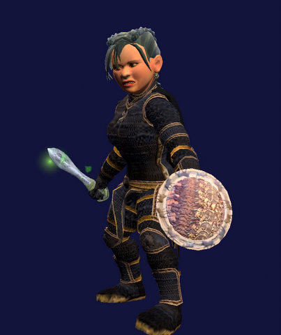
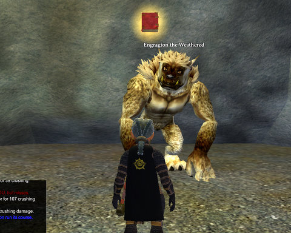
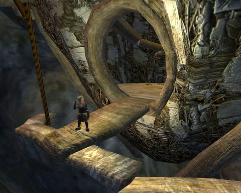

# EQ2: Eitholi, Blade of the Fae

What takes two hours to do, results in a blade nobody will use, and no status at all?

That would be the signature quest that ends in Eitholi, Blade of the Fae. Here in the dressing room, since Etha -- now known as Ettie -- can't wield it. Green glows are uber. Too bad the stats aren't!

It wasn't a total wash. Ettie got enough AA experience from all the subquests that she dinged 30 AAs, and, after finishing the Wisdom/Ritualist AA line, is heading down the Stamina line, which includes a very cute little buckler attack.

To be honest, I had no idea what the quest was when I started. YEARS ago, I'd picked up a quest from some fluttering ghostly angel thing on a cliff in Butcherblock, and just never worked on it. Well, back then, you had to understand the language of magic to advance the quest. A quest requiring someone to explore level 40+ zones to learn a language to do a level 20-ish quest? There was no way that was going to happen, so I just let it sit there in my quest journal.

Since I can't level Dina any more, being at max level and max AAs, I've been spending a lot more time on Ettie, and it's been a bit of a contest with myself to see how far I could get on this quest ("The Wind that Speaks Her Name") before I got a group. Last night I got all the way to Greater Faydark, headed toward Crushbone, when I got a group invite for Deathfist Citadel.

I've done it before, I always have a couple of quests that need me to go there, so I'm happy to go. They didn't have a healer and I didn't think I'd have any trouble keeping a group alive there. Defilers are pretty good at their jobs, and their slows take the bite out of any fight.

So I was more than a little alarmed when the group started discussing if maybe one of them should switch to a healer, since they couldn't find one.

I'm a defiler, I said. I can heal, you don't need another healer.

The tank discussed switching to his warden.

I'm a defiler -- shaman subclass, I'm a priest classs, you don't need another healer!!!

But, said the tank, I need Fyst on this character, so I dunno.

HELLO??? Is this thing on? Can anyone read this message? Seriously, I asked that. I'm not even exaggerating here.

Someone piped up, and mentioned that he thought defilers were a cleric class, and the group had a healer.

I cannot COMPREHEND how people can play a game this long and not know the difference between defilers and inquisitors, or believe a defiler is a kind of necromancer. Maybe they should just change the class name to "Evil Shaman".

Went through the entire dungeon, no deaths, dinged to level 43, it was fine, no problem. Yeah. Okay. NOW you know what defilers do. We keep you ALIVE.

Anyway. When I got out of DFC, I started in on the quest in earnest. Made my way to Crushbone Keep, found the sword that was stuck there, cleared a room of mobs so I could rez someone who was dead in the middle of it, did some of the badge collection quest from the zone, wandered off, and spent the next forty-five minutes looking for someone named The Witch of the Wood.

I finally backed off far enough to notice a climbable wall leading right to her.

I didn't speak her language, so I went to Kelethin and learned the Fae language.

Nope, that wasn't it. She spoke Fairy, not Fae. Because, I'd know the difference. So half an hour toward killing treants for Fairy language bits, and then she tells me a story about a Fairy who had gotten herself trapped in a sword, which had been stuck into a tree, and the tree had grown up around it, and I should go find the tree and the blade in it.

The tree had turned into a Treant who was menacing the cliffs above the Shores of Growth in the Nursery. He said, sword? Oh yeah, I have a sword, and it hurts like anything. If you could get some aviak eggs from Butcherblock, that'd be sweet. We can mix them up into some sort of magical Vaseline and it will slide right out.

Yeah. Whatever.

So another half an hour trying to figure out how to get up to that nest I could see stuck to the side of a cliff hundreds of feet above my head.

Turned out to be ANOTHER hidden climbable wall. Got the eggs, went back to the Treant, he decides he doesn't want eggs after all, he just wants to kill me, so he attacks me. Occasionally he stuns me, but my faithful wolf, Cinnamon, takes over when that happens.

Finally kill him, I pull the sword from his splintered corpse, ding 30 AAs and add an exciting 0 guild status to my awesome total of 70.

Oh, well. At least it makes for a nice screen shot.

