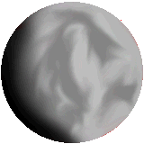

# Do Dwarves Come From Dwarf Planets?

*Posted by Tipa on 2006-08-24 11:08:07*

Poor Pluto. For nearly a century it had been sitting at the big table with the other planets. And did it complain? It did not. It was just happy to be here.

But rather than admit potentially a dozen smaller planets to that exclusive club, the [International Astronomer's Union](http://iau.org "IAU") decided to [demote Pluto](http://news.bbc.co.uk/1/hi/sci/tech/5282440.stm "BBC News says...") to the status of a "dwarf planet".

Its crime? Having an eccentric orbit. Yeah. That's been a felony in the Alpha Centauri system for about a million years.

If Pluto had never been named a planet, if from the start it had been seen as no more than a fairly large chunk of ice in the Kuiper Belt, would we have ever dared to imagine what life on the most distant known planet would have been like? Stories by Stephen Baxter, Kim Stanley Robinson and others made Pluto the place in the Solar System where the truly weird stuff happens. Right out there at the boundary of imagination. If it had never been a planet, would we be sending the Pluto Express probe out there to meet it?

I was hoping some of those asteroids would get some recognition. When I was a kid, I read all these golden age SF stories about life in the asteroid belt, with Ceres as the center of a civilization that had little to do with gravity. The battles for independence from Earth; fighting off raiding parties from the colonies on Jupiter's larger moons; the first stop on humanity's journey from being a planet-bound organism to something truly transcendental.

But the IAU has taken a step back from that vision. Instead of imagining the Solar System as a vast cloud of potential life, we're stuck clinging to a few hostile oases in a vast emptiness.

Can't help but hope the Voyager spacecrafts find something mysterious and large out there at the boundaries of our solar system. We need a new marker to denote the edge of the possible.

(on a really unrelated note, click on the badly drawn picture of Pluto at the top to see the applet I wrote in response to someone asking for "an applet that showed ballistic motion. Maybe you could have a UFO dropping a watermelon on Earth, Jupiter and Pluto and have people figure out what the initial delta vee would have to be in order to hit the ground at a specific time." That's all they gave me.)
