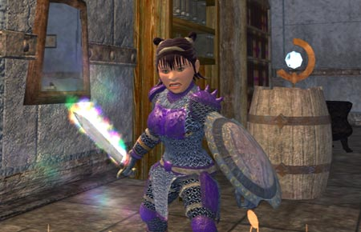

Back to: [West Karana](/posts/westkarana.md) > [2006](/posts/2006/westkarana.md) > [July](./westkarana.md)
# Deception: Who is Deceiving Who?

*Posted by Tipa on 2006-07-23 07:14:35*

Though we didn't get to go to the Comic Con yesterday, it did mean I was able to finish up the Deception quest to get my first Prismatic weapon from Nagafen as reward for taking care of Darathar's threat. Turns out his anger over Lady Vox's death and frustration at the Drakota for bringing a dozen kinds of pain to the people of Norrath and his anger at Darathar himself for stealing Naggy's "only" prismatic egg were just a ruse to get us worked up enough to do his dirty work for him.

He actually had plenty of eggs. He just hates making the trip up to the surface to do it himself. And after a dozen trips up and down the whole of the immensely over-huge dungeon, I can see his point.

The prismatic longsword isn't that wonderful, but it made a better sword-and-shield combo for soloing or light tanking than I had before. I used it for just that to help a friend with her last two fights for her Golden Efreeti Boots - tanked both Magmoleus and Efreeti Lord Djarn.

Joined again with the Legends crew and took on the evil beast Lockjaw, who, though a level 62x4 epic monster, was worlds easier than Darathar, a 55x4 epic.

Was getting late, but went along with them to a Poet's Palace: Return raid. The first mob dropped a cutlass which was amazingly better than the prismatic for a 1h/shield combo; and I won it... a good solid month of weekend raids to get the prismatic, and I upgrade it within three hours.
