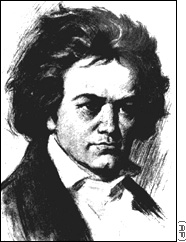

Back to: [West Karana](/posts/westkarana.md) > [2006](/posts/2006/westkarana.md) > [July](./westkarana.md)
# Beethoven Answers Your Questions

*Posted by Tipa on 2006-07-25 16:04:13*

*Today, regular correspondent and composer Ludwig von Beethoven answers your questions about his famous Ninth Symphony.*

**When and where did you premiere your ninth symphony?**

We held the first performance on the seventh of May, 1824, at the Kärntnertortheater in Vienna. I wasn't sure it would be well received in Vienna - the whole city was just overrun with Italians. But my friends thought it'd be a big hit there, and really; where else *but* Vienna?

My symphony was third on the bill. Mine was the longest symphony anyone had ever written up till then, and used the largest orchestra to play it. Nobody had thought to put a full chorus in a symphony before I did it.

**How long did it take you to write the symphony?**

Oh, my. Ages. I was working on setting Schiller's poem "Ode to Joy" to music as far back as 1793. But it was tough going. There's no poet better than Schiller. Goethe? Don't make me spit. And great poetry *demands* great music.

The Society of London commissioned me to write a symphony in 1818. I finished it early in 1824.

**Were they pleased with it?**

I should say so! When I found myself low on funds a few years later, I wrote to them, and they sent me a hundred pounds immediately. The Society of London was always good to me. Why, in their very first concert, they performed one of my symphonies, with the great Muzio Clementi on piano. I, however, was not able to meet them in London due to my poor health.

**You said your symphony was the longest ever written until then. Why was it so long?**

Some called my fourth movement, the Chorale movement, rambling. What they didn't realize is that it was a symphony in its own right, with four movements placed one after another without pauses! That's double the value for your money, right there.

**You're deaf; how did you conduct the orchestra?**

And thank you for bringing that up. I may not have been able to hear the normal way, but I heard every note with a clarity that would astonish you.

Kappelmeister Ignaz Umlauf (Umlauf, nicht Umlaut, we called him) helped conduct that night. I kept the time, and he directed the orchestra. I didn't find out until later that he had told the musicians to ignore anything I directed on stage!
