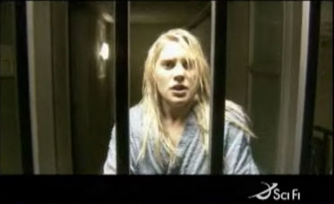

Back to: [West Karana](/posts/westkarana.md) > [2006](/posts/2006/westkarana.md) > [September](./westkarana.md)
# Battlestar Galactica Webisodes

*Posted by Tipa on 2006-09-06 08:45:32*

I've been in and out of the SciFi Channel's website for the past couple of weeks working on my Who Wants to be a Superhero article; I'm surprised I didn't see that Battlestar Galactica would be showing little "[webisodes](http://www.scifi.com/battlestar/)" leading up to the beginning of the third season on October 6th. The first one, posted yesterday, is Day 67 of the Occupation: Resistance.

If you like seeing quality science fiction on television (my likes: ST:TNG, Firefly, Babylon 5, Farscape, The Prisoner, UFO (not Project UFO), Doctor Who; dislikes: Stargate SG-1, Andromeda, X-Files), you need to be watching Battlestar Galactica. And if you love BG like I do, you'll want to see these webisodes. And if you want the SciFi channel to focus more on quality science fiction and less on wrestling or whatever, watch their good stuff.

As long as I'm here talking about SciFi channel offerings, I want to mention Eureka. I've seen pretty much all of the episodes now when Turner Classic Movies isn't running anything I want to see (and I'll be talking more about TCM someday), and I just have a couple of questions... all to do with the premier. First, what happened to the mysterious dog? Second, why did they see themselves leaving Eureka the same time they first came into it? Third, what happened to the evil slut counselor?

The last episode I watched took today's problems with drugs, over-diagnosing kids with behavioral disorders, and the pressure to achieve, and faced them unflinchingly and head-on by showing what would happen if some kids created a super-Ritalin that let them run five hundred miles an hour.

If ya don't watch Battlestar Galactica, this is the sort of thing they're gonna show. You have been warned.
