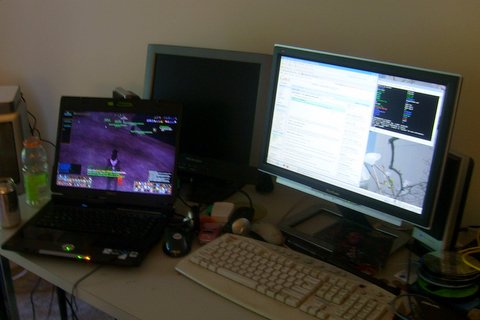
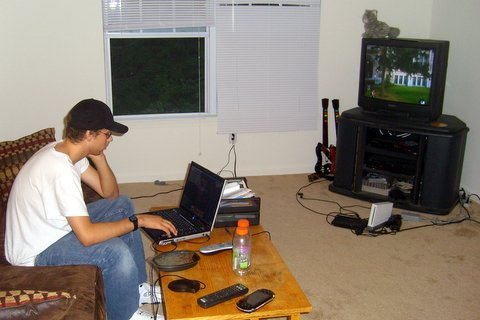
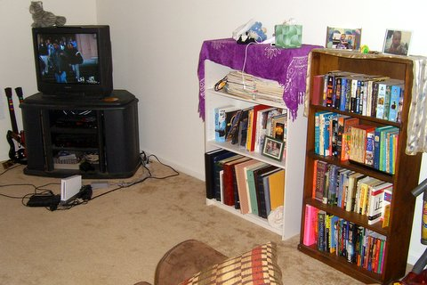

# My Space

*Posted by Tipa on 2007-06-12 19:21:11*

Cuppy of Cuppycake.org asked bloggers to [post pictures of their gaming setups](http://www.cuppycake.org/?p=110). Mine's in a bit of a flux; my main gaming computer just died, and I have a laptop replacement.

Here's mine. The left rear screen is for Supernova, my recently deceased computer. In front of it is Darkstar, its replacement (after a star goes supernova, it becomes a dark star... Hey, my LAN is called GALAXY, I have to keep with the theme). The widescreen and keyboard to the right are Baphomet, my Linux computer and the one I use to watch movies and program. Waaaay to the left you can see a bit of my 15" TV, and on top of that is Spock's Brain, the external USB drive enclosure that has Nova's main drive in it. You knoew you're a geek when you just happen to have a USB drive enclosure lying around.

Anyway, Cuppy's upped the ante with her workplace, but mine is boring. A laptop connected to a docking station, I haven't brought anything of my own there yet.

Now, for consoles, our trusty Wii and Playstation 2. We have a Nintendo 64, SNES, Dreamcast, Sega Saturn, a Colecovision and an Atari 2600 packed away. My son, who plays Readysetboom! on Nagafen, is holding down the couch...

Dunno why people are so concerned with people's bookcases; here's a couple of mine. The rest are in my bedroom, which is messy...
