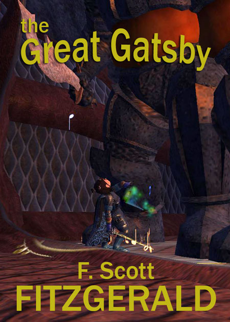

# EvE: Book cover edition

*Posted by Tipa on 2007-07-22 19:55:51*

Whilst playing EvE Online today, it occurred to me that SF book authors are missing a real savings, book-cover wise, by not just finding a good screenshot in EvE and using *that* for their cover... Why, if more people did that, we could have books like... hmm...

There's a big seller for ya. Who wouldn't buy a book by someone named Spock?

One woman's tale of reaching middle age and coming across a nest of Kilrathi in Beta Sector...!

Hmmm... Wonder if this works for Fantasy pics?

Yup!
