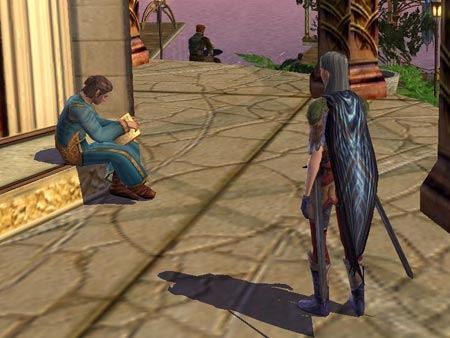
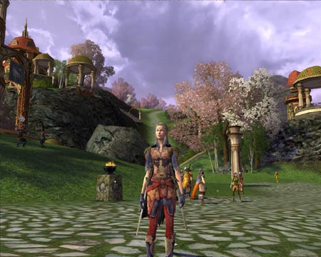
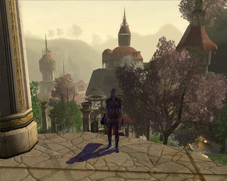

Back to: [West Karana](/posts/westkarana.md) > [2007](/posts/2007/westkarana.md) > [April](./westkarana.md)
# LotRO: The Champion

*Posted by Tipa on 2007-04-03 12:45:38*

*Whatcha reading? The Fellowship of the Ring? Dude, Gandalf isn't really dead. Oh yeah, and Frodo like totally wants to keep the ring at the end but Gollum grabs it and falls into Mount Doom.*

Busy busy weekend but I found a little time to play in the Lord of the Rings Online Open Beta. I played a Hobbit minstrel in the stress test; time to check out the other classes to see what they were like.

I wasn't that pleased with the Minstrel. Minstrels seemed weak on dps, and their healing was really nothing to get excited about. More of a balance issue; would you rather spend your time healing yourself or just take less damage to begin with?

*No Hobbits or smelly Dwarves allowed in the Grey Havens!*

The Champion is LotRO's melee damage class, roughly the same as World of Warcraft's Fury-specced Warrior, EQ2's Brigand/Swashbuckler or EQ1's Berserker. Champions can tank, but are at their best when they throw defense out the window and unleash their devastating single target and area attacks. Champions can eventually gain the use of a shield and bend their talents toward tanking, but that job is best left to the Guardian.

Very similar to WoW, Champions use attacks that generate Fervor points, which can then be spent on a number of special abilities; at level six my champ can spend points on a short term haste buff or two high-damage special attacks. She can also enter a special Fervor mode where she trades ALL her defensive moves for an increase in damage and hit percentage. Even solo, this mode takes down groups of mobs *fast*.

Elves share their newbie instance with the dwarves, and there's little to say about it other than that at the end of it, you've learned how to move and attack, probably picked up some decent armor and possibly have grouped once or twice. The "600 years later..." bit between the introduction and the shared newbie zone is very nicely done. "Hey! Isn't that the snow troll Elrond defeated outside the gates?"

Yes, yes it is.

*Champion strategy note: Champion special attacks are based on the **damage** of the weapon, not the speed. So get the highest damage one-handed weapons you can find and go crazy.*

*Quite easy to become lost in the gorgeous vistas of Elfland...*

