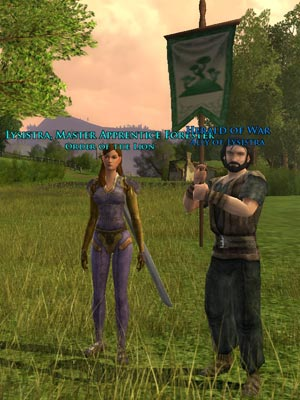
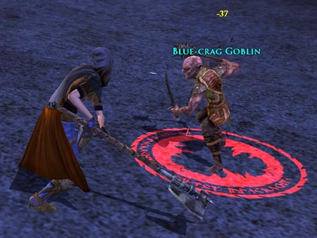

Back to: [West Karana](/posts/westkarana.md) > [2007](/posts/2007/westkarana.md) > [April](./westkarana.md)
# LotRO: The Captain

*Posted by Tipa on 2007-04-11 04:23:34*

*Stand back, Lysistra! I shall bash this fell beast with this little flag!*

I didn't want to discuss LotRO's Captain class until I'd gotten to level 10 and earned the Herald pet. This little friend will help you in battle, cast little buffs or debuff the monster some, do a little damage and in general, act like your little brother. He doesn't do a lot of damage but he sure can annoy the mobs.

A Captain can do moderate DPS, but their role in a group is to cast short buffs to dps, speed, healing, resilience and that sort of thing. They prefer two-handed weapons and do get a taunt and thus can also tank when needed. Calling them LotRO's paladin class wouldn't be far wrong. You could call them LotRO's bard class and you still wouldn't be wrong. Heck, you could even make a case for them being similar to EQ1's Beastlord. No matter how you compare them, they are this game's hybrid class, able to do a lot of things acceptably but not shining in any one thing.

I'm particularly disappointed in their healing. Like several of their abilities, healing can only be started when a creature dies. It's a medium heal at the start but then continues for a few seconds as a very weak heal. Instead of putting all the healing onus on the Minstrel, the Captain should be able to heal for their group with their heals-over-time, making fellowships less dependent on one single class.

I've had a lot of time to spend on crafting. Lysistra is working on mastery of tailoring while Eraindiel focuses on weaponsmithing and woodcraft. The gear made is decent; nearly everything Lysistra wears was made by either her or Eraindiel because it is better than most drops or quest rewards. Far better when you get the rare drop recipes.

Eraindiel, is 15 now and no longer earns experience through quests. The idea here is to do as many quests as possible up to the turn in and then... don't turn them in. When the game goes live and the level 15 cap is removed, *voila*, instantly 16.

At 15, the champion DPS is astounding. I just might keep her around. Of my four "starter" classes, though, I have played the minstrel, captain and champion, but not yet the burglar. Do burglars just burgle, or can they fight?

I'll let you know next time!

*Eraindiel going elf-wild on a gobber.*

