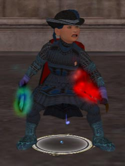

Back to: [West Karana](/posts/westkarana.md) > [2007](/posts/2007/westkarana.md) > [April](./westkarana.md)
# EQ2: Fangs a Lot!

*Posted by Tipa on 2007-04-11 21:45:18*

Between doing my epic run from Ered Luin to Rivendell tonight on LotRO, and giving a big HECK YEAH to Haley the Skank as she was booted from American Idol tonight, we kinda maybe destroyed Lord Vyemm AND his lab ("and I would have gotten away with it if it hadn't been for those meddling adventurers!").

We've been able to do guild-only raids for awhile now, and the guild reached level 60 sometime while I was moving and we even got a new cloak that has something to do with Revolutions (a clenched fist against a Les Miserables-ish black-and-red field) instead of the Spiderman cloak we'd had. And we're going to try Freethinkers this Friday, so I'm keeping my toes crossed that people have their listening caps on that night... it's a tricky raid.

Anyway, at the end of it a certain plucky haffer troub walked away with a green glowing Fang from that horrid dragon to match the red glowy dagger she already had.

Now, Dina looks wow! Or should I say... WoW!?
