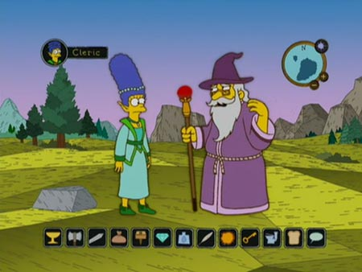
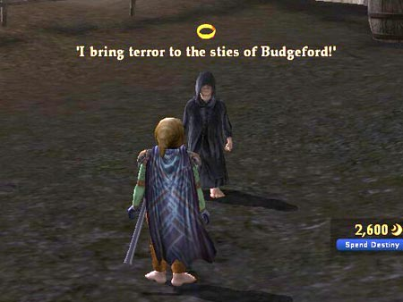
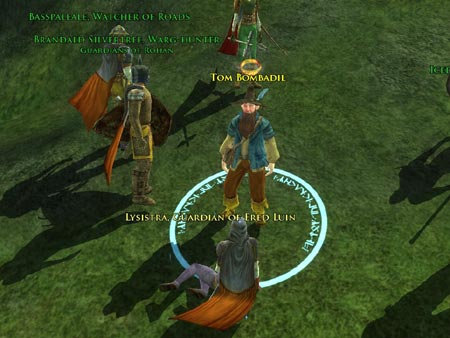
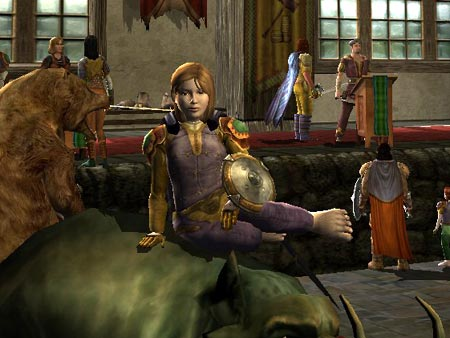
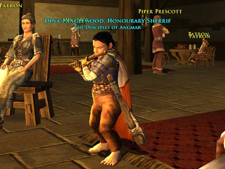
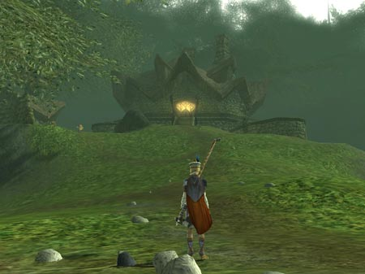
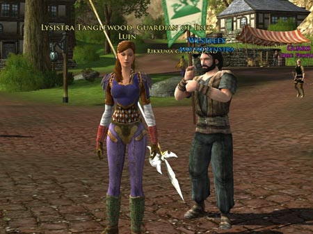
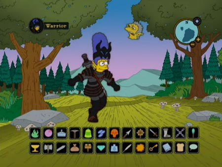

Back to: [West Karana](/posts/westkarana.md) > [2007](/posts/2007/westkarana.md) > [April](./westkarana.md)
# The Good (and the Bad) of Lord of the Rings Online

*Posted by Tipa on 2007-04-25 04:33:42*

*
Gandalf points a new player toward the next step in her Quest.*
I logged my Champion in to Lord of the Rings Online last night, turned in the quests I had been saving, and then stopped along the bridge to Bree and asked myself if I shouldn't just log out and forget about the entire game. The /ooc chat was infantile, my kinship is made largely out of grade school kids, Bree itself was as laggy as Stormhold on a bad memory day, and, let's face it, the game has almost nothing to do with the books on which it is loosely based. In LotRO, *everyone* knows Tom Bombadil, pals with wizards, and ridicules dwarves. If the books had been based on the game rather than the other way around, Farmer Maggot's hounds would have been picked off by a hunter hidden over the horizon.

But, yes, LotRO is very different from World of Warcraft. In WoW, you don't get horses until 40. LotRO gives them to you at *35*. And instead of costing 80 gold, they cost the LotRO-equivalent of about 30 gold. The game is so obviously meant for WoW players in every way -- as if Turbine's goal was to specifically make a better WoW instead of a better MMO.

That out of the way, there's a lot of reasons *to* play. Like finding a pint-sized "Black Rider" terrorizing the residents of the Shire. THAT was a total shock. I was in Budgeford crafting when I hear a Black Rider outside saying things like "Today the Shire, tomorrow the world!". I'm not feeling any of the dread that comes with a real Black Rider, so I run out and am confronted with... well, who the heck IS he?

The so-called "Chapter" quests, the storyline quests that advance your tale simultaneously with the more famous tale of the hobbits and the One Ring... vary. It's fun to see what's happening with the main story and how every single other person in the realm is working overtime to make things easier for the Fellowship. Blasting away a particularly nasty wight before the hobbits can run afoul of it... very thrilling, and the quest is perfect for teaching the ins and outs of grouping. The quest before it, picking flowers near Old Man Willow... not as much. That's "Chapter Nine of the Epic Tale of the Fellowship: Picking Some Flowers."

*
Dera (13 Guardian) relaxes at the Bree auction house.*
For every "Defeat the Fallen Ranger before he turns evil" quest, though, there are ten "Kill six pigs and bring me their tusks" quests. At least you can gather several similar quests together and do them all at once for massive quest xp when you turn them in. Last night, I had Eraindiel (elf champion) in the Lone Lands along with a hundred other people working the ruins near the Forsaken Inn. Every goblin or wolf kill dinged 2-3 quests. Dinged 16 and am halfway to 17 just for an hour or so of work. So at least grinding is a little more worth it than in the competition.

*
Dina (15 minstrel) going all Aqualung on the patrons of the Prancing Pony.*

Every reviewer talks about LotRO's polish. Being able to play your own music on instruments -- *that's* polish. That one feature just blows me away... hearing a player lutist picking out Metallica's "Unforgiven" in the shipyards of Celedorm is both right and wrong in so many ways :P

Some snarky people might say that they had plenty of room for polish since they ripped so much from WoW. The auction house, the way you can track resource nodes, all the little pieces and bits they didn't have to design themselves, so they could put in the time they needed to make the game look utterly fantastic.

*
Tom Bombadil's house in the Old Forest almost glows with warmth and magic.*

Graphically, this game is so far beyond WoW and even EQ2... bloom, advanced lighting, great textures; LotRO uses the most advanced graphic engine I've seen so far (Vanguard's might be as good, I don't know). I and many others have mentioned before that the landscapes look more painted than rendered; almost any screenshot you could take could be a painstakingly painted book-cover.

*
Lysistra (15 captain), with friend, in Combe.*

LotRO is not the game for everyone. I doubt people who come to the game purely because of love for the lore will find much to keep them; playing a side story that wasn't even actually in the books is just odd to begin with. Why not set it in a previous Age, when deeds of heroism and danger were far more common than in the rather less dangerous Third Age? Or set it after the events in the book, when the agents of Mordor, freed from Sauron's control, could still cause harm and must be dealt with by adventurers?

But those who come to the game looking for a familiar experience in a new setting with enough differences to keep things interesting will have a happy time in Middle Earth, and for them, I very much recommend it, especially if you bring some friends along with you.

