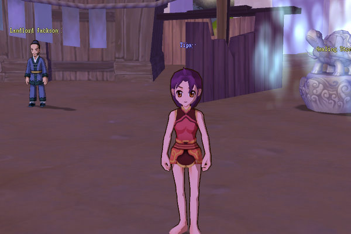

# Dream of Mirror Online

*Posted by Tipa on 2007-12-05 08:49:07*

I downloaded Dream of Mirror Online (DOMO) last night, and tried to get it to work under WINE in Linux, but no dice, so I installed it on my Windows machine. 3D anime style Korean (not Japanese) port, which means that looking for their Advanced Recon Intelligence Gathering Automatic Targeting Ordnance (ARIGATO) will probably end up disappointingly.

It's gotten some fun reviews over in Massively and elsewhere, so what the heck. I've played other of their imports... and they're usually at least a little fun and always free.

*Note: Spammers have elected this post as a Spiritually Significant Movie. OMG, Spielberg move over!*

