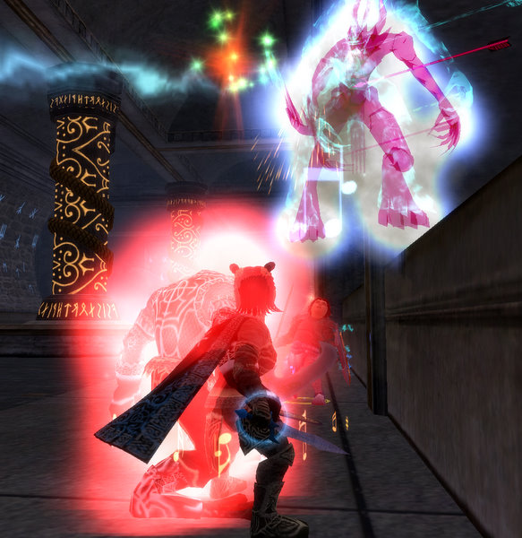
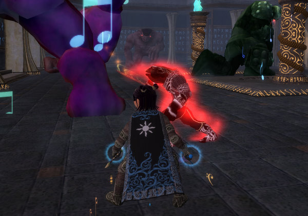

# EQ2: Charasis -- The Vault

*Posted by Tipa on 2007-12-11 08:33:24*

No time for leveling last night; when I sat down to play, I was invited to a Crypt of Agony group right away, and of course, I had to go. Have I mentioned that dungeon crawls are my absolutely favorite thing to do in EQ? It would be fair to say that meeting the dangers along with new friends is at the very heart of what makes MMOs enjoyable, for me, and the more time I spend in a group using all my character's abilities to the limit, the more fun I am having.

Diametrically opposed to leveling alone. Although the true best size of an experience group in Rise of Kunark is not one and not six; it is two. Grab a friend on the same quests and nothing much will trouble you.

I logged in at around nine last night. I was the only person on in my guild, and after checking the broker and repairing, headed back to Kunark. I was on the Sokokar ride through Kunzar Jungle to meet up with Dera when I got the invite; Immediately turned around and flew down to Sebilies. Just one healer; a 75 Inquisitor, same as Dera; I doubt I'd want to solo heal the Crypt, but he did fine; one of our smoothest (if not fastest) runs. Each time through, I find little things I can do to make the final fight easier, aside from just blade dance, maestro and jesters to the right people. For instance, the dungeon up until then needs elemental resistances -- the last boss wants arcane. Stuff like that.

The group leader suggested we follow up CoA with a trip to Howling Stones.

Mmmm. Howling Stones. 

That zone was death on a stick back in old EQ. Pit traps, being overwhelmed by mobs (it wasn't hard for one skelly to turn to twenty, and in later years, it would become a place to powerlevel because of that), but you would need a big shovel to move all the loot you'd get. The old dungeon was set out in four wings, one for each cardinal direction, and you progressed through them in order, gaining access to each wing in turn (and doing a quest along the way that would allow you to skip some wings in the future). If you could handle the dungeon and knew not to step on the rugs, it was some of the best loot and best experience in the game.

The new Howling Stones knows about the old one. OSHA has been after them, apparently, and now the pit traps have elevators back up, which is really kind of them. Most of the bosses are also wheelchair accessible, and there are handrails along every corridor.

We went to one of the Howling Stones instances, "The Vault". This is a labyrinth covered with glowing runes and puzzles. I wasn't quite sure what to do with all the glowing gems; they needed to be placed in certain spots. Ancient scrolls needed to be read and their equally ancient guardians dealt with. Loot needed to be given to the scouts *ahem* yes, y'r faithful haffer got her first piece of the RoK legendary set, the Shoulders of Imperious Strikes. That wasn't the only loot that dropped but it was the only piece I got -- and it was plenty.

We ended up facing a tall phylactery, guarded by a glowing skeleton. The group leader warned that two skeletons would spawn from the urns to each side, walk toward the boss, and heal him. I volunteered to mez them, which I did, and it became the easiest fight of the night, as the two helper skeletons gazed, stunned, at the ceiling. Someone had shared a quest for that phylactery, so we all got that update. The master chest had gotten stuck in the wall, but I found if I went to first person view, stuck my nose to the wall and then turned around, there it was, so I opened it and there was some nice loot for the tank and one of the casters.

We left HS, went out to the Jarsath Wastes and killed the lady to finish the quest; I got a level 80 necklace which claims to heal for 55 points (!). When it was linked earlier it was for a LOT MORE THAN THAT. Maybe when I hit 80.

CoA = 10% xp. Vault = ? I think it was 20%, including discovery xp. I did make an AA point; I think I have 122 or so now. 35.6% into 78.

*Spammers have noted this post as one of the Best Non-Fiction Books of the 20th Century.*
