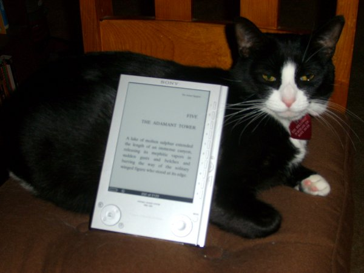

# I love my Sony Reader, and so does my cat.

*Posted by Tipa on 2007-12-12 08:41:48*

I owned a house up in Monterey, California. I loved that old house; I raised my kids and my cats there, and it had oodles of space, and I had books pretty much everywhere. Two book cases in the garage, two in the family room with the computer, two in my bedroom, a huge one in the living room... because I really like reading.

When I moved from a house in Northern California to a small apartment in San Diego, the books had to go. I gave books to all my friends. I donated books to every public library in the area. I dropped off sacks of books at the local used book stores. When I couldn't find anyone else to take any more, I threw the rest away, keeping only my absolute favorites.

I still have book everywhere. I can't *not* read them.

Though it's hard. A couple of years ago, I got bifocals (ftw!) and though I can read the computer screen and drive, it's very hard for me to read with them. They could have tuned them for reading, but then, I guess, using the computer would have suffered. Anyway, I hate these glasses. Because I love reading, and reading suddenly became a matter of getting the right light at the right distance at the right angle, and so many times these things wouldn't come together and reading was a real chore.

My two books a week habit dropped to a book a month. It took at least that long to finish the last book I read, one of those huge fantasy novels. Which had another issue -- it was a big, giant hardcover, not the kind of book you bring with you.

Amazon released a month or so ago, their Kindle. an e-book reader. It uses e-ink, a display technology made of millions of microscopic spheres, black on one side and light gray on the other. They are rotated electrically to show their black side, their white side, or (I think) halfway, and once they are rotated, stay -- so the display only takes power when it is changing, and since the display is actually changing color, has the same properties as paper -- you can't read it in the dark.

These sorts of devices can hold hundreds of books, fit easily in a purse, you can make the text larger so it is easier for old blind people like me to read, and last friggin forEVER on a single charge.

Oh, except the Kindle does not. Since it has wireless connectivity built in, and a semi-active user interface. it lasts about a day on a charge. Also, they DRM the books you buy, charge you money for every little thing... and so in the end, I went with the Sony Reader.

This competing product is a couple of years old. A charge lasts for 7500 *page turns*. If you don't turn pages, you can leave your Reader displaying a page, come back in a month, and it will still be there. You can import nearly anything, except, oddly, HTML, but a third party utility called libprs500 (for Windows, Mac and Linux) does that conversion (and also can convert websites; I have the entire BBC news site as of Monday on my Reader).

Both Amazon and Sony have ebook-stores for their devices. Amazon's is probably larger, but they can revoke your books at any time, and that's not much fun. Sony gave me 100 free public domain books formatted for the Reader. I could go to Project Gutenberg and just import them, but they look better specifically formatted. I got Alice in Wonderland and some others.

I also bought the third book in Pullman's "His Dark Materials" trilogy, "The Amber Spyglass" and Charles Stross' "Halting State", about a bank heist in a World of Warcraft-like virtual world, just because Stross hates ebooks so much, but urges people to buy his stuff if they feel they really must have one.

The first book cost me about $3.50, the second about $14. Obviously, the paperback edition of Stross' book would be cheaper, but then again, I can barely read paperbacks these days, so the extra cost doesn't bug me much.

I am happier about buying this than I have been about an electronic device in a long time. I can read again. It's easy. I have a dozen books in there; Verbor Vinge's "Rainbow's End" is in there. I'll probably subscribe to the Baen Free Library and get a bunch more free books, and I've been having a real urge to read Fred Saberhagen's "Empire of the East" again. *cough* $11.16 for a book at least thirty years old? Well, it is a trilogy... still seems a little much. How about Roger Zelazny? Oh, nothing by him. I would have paid for "Creatures of Light and Darkness" in a hot second.

This is the failing of the Reader, and all ebook readers. There's a lot of books NOT available. I could go to a good used book store and buy these things. I wonder how legal it would be to buy a used book and scan it for my own use? I'm sure a lot of these books have found their way illicitly onto the web, but do I want to go there?

Ever hear of "The Long Tail"? In a store that can offer *everything*, a lot of people will buy the most popular things, but even more people will be looking for the uncommon things; and these uncommon things add up over time and with enough variety to completely overwhelm the common. This only works, of course, if your inventory is enormous. I don't have the exact numbers, but Netflix reports that their most common movies ebb and flow in popularity, but their rarer stuff is always being rented and brings in the really consistent income.

There's an opportunity out there for someone to go to all these used book stores, buy up everything they have, get the ebook rights for them, scan and format them, and then sell them. 

Hmm... I think I'll grab China Mieville's "Perdido Street Station". On sale for $5.59, and he's a pretty cool writer... I'll be gone to California for the next few days and I want to bring a few good books.

There, bought and put on my Reader.

I love this thing.

