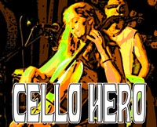
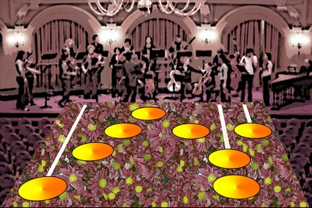

# Kiss Your Air Cello Goodbye!

*Posted by Tipa on 2007-01-10 01:15:19*

Yoyo Ma? YO MAMA!

Yeah you, the guy who loses it to largo. Schizo for scherzo. Tantrums for tarantellas. Sawing away at the air cello through the entire winter concert season.

Take the symphony home with you!

Cello Hero brings the symphony to your living room!

Greatest hits from four centuries of cello's finest! Bach! Bann! Bantock! Bax!

Solo play or gather a dozen friends for multiplayer ensemble action! Or tab a friend for cello duels a la Dutilleux!

John Cage - One^8

George Crumb - Cello Sonata

Jonathan Harvey - Curve with Plateaux

Mauricio Kagel - Unguis incarnatus est

Alvin Lucier - Indian Summer

Giacinto Scelsi - Voyages

Dozens more! Rock out to avant garde classics like Wuorinen's "Cello Variations", or Iannis Xenakis' "Nomos alpha".

Live the dream! Dream the life!

CELLO HERO!
