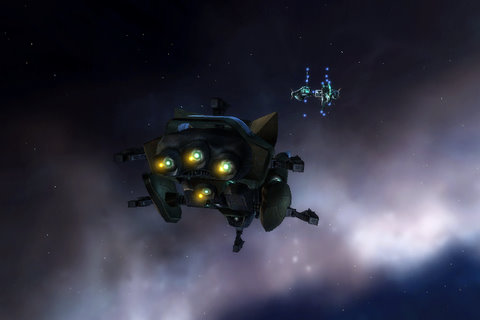

Back to: [West Karana](/posts/westkarana.md) > [2007](/posts/2007/westkarana.md) > [July](./westkarana.md)
# EvE: Transport through my system, play by MY rules

*Posted by Tipa on 2007-07-19 07:18:42*

I hadn't finished training Gallenite Frigate III before I left for work, so there went the whole day... not training anything... Naturally, the very first order of the night when I got home was to start my training (I chose Electronics up to skill level II, now doing Science V which seems required for a lot of fabbing).

The second was to buy my Incursus Killing Death Machine of Hurt. Those smug jerks bringing their trash through Luse thought they'd seen the last of me when they blew *Isis' Dark Laughter* out of the sky. They were going to understand just how cold space can be.

*Isis in Shadow* strained at the force beams holding her in her hanger bay. Her sensor displays were rimmed red around the edges with blood lust. She couldn't be more different than my amiable miner, *Dark Laughter*. But then, I wasn't looking for a ship that could settle down for a nice meal of Veldspar Chex. I wanted a killer.

Three turrets, fitted with 150mm Gatling rail guns shoving superheated iridium into the astonished maws of my killers. Backed up with the best shield boosters I could use, a nano-armor repair unit I picked from some pirates, and an afterburner I had left over from an orgy of afterburner production I made accidentally during a tutorial mission.

I had to blood *in Shadow* first. I had some drones who needed schooling. The three guns chugged once for each drone, and that was that.

Back to Luse for the personnel transport. The CEO of my corp offered to help, and he met me at the acceleration gate into deadspace. We warped in together, cleared the vanguard, then warped to the second encounter and watched in wonder as wave after wave of ships popped out of warp. He released his cloud of combat drones, and then went link dead.

I tried to turn back, but *Isis in Shadow* refused. We rode in on a trail of plasma and skulls. I'd grab their attention with a shot or two, then lure them back to the drone cloud, where even link dead, my boss could help kill. That was too easy. That wasn't revenge enough. So I went in alone. Guns overheating, cargo hold getting low on rounds, capacitors dryer than last year's Thanksgiving turkey. Bam! All dead.

I wasn't ready for the last attacker... in an evil twist, my CEO's link death had turned his ship aggro, and he began his approach run. his shots somewhat more effective than those of the wrecked rebels. Thinking that destroying his ship while he was link dead would be a Bad Idea, I just tried to stay out of range until his ship finally was able to leave the game.

*in Shadow* proved herself many times that night. But I may just find a kindly old shipyard somewhere that might have another Maurus in the back lot who needs some love.

I have some mining lasers waiting.
