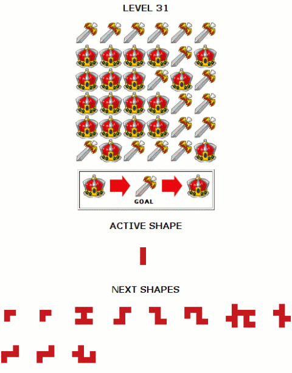
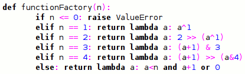

Back to: [West Karana](/posts/westkarana.md) > [2007](/posts/2007/westkarana.md) > [June](./westkarana.md)
# Neopets, Lambda Calculus and Decision Tree Pruning

*Posted by Tipa on 2007-06-23 01:44:47*

"What has she been working on?" you might well ask. "All this raiding, all these long long long comments on everyone else's blogs but precious little here?"

Well. Aside from raiding with Eternal Chaos and occasionally visiting Nagafen, I have been trying to solve a puzzle on the children's MMO/Community Site, Neopets.

This place... is deceptive. There's stuff there for adults. In fact, I sometimes think there's two tiers to the game; the lower tier, where children socialize, play games, earn Neopoints and play with their Neopets; and then there's the upper tier, where adults think of innovative ways to fleece the children of their money and items through legitimate methods, such as the thriving commodities market in the game.

I'll be working on that later. The ticket to entry to the adult tier is software. Stuff in the adult tier is too complicated and fast paced to be done by any human, and so people write programs to do program-based commodities trading, play their stock market, and solve some of their games.

One game in particular is nearly impossible to do without a computer, and that's the one that's been taking my time. This is a "game" which gets exponentially harder (literally) each level.

It's very simple. You have a grid containing from two to three (so far) kinds of shapes, and up to twenty or so variously shaped pieces. Placing a piece on the board changes all the squares under it to the next shape up. You must use all the shapes, you must place them in order, and in the end, every square must show the "goal" piece.

Brute force worked up until about level 21, when they introduced a larger board. I rewrote my program to use bitfields instead of relatively slow arrays, and then at 25, they moved to three value squares instead of the old two value ones. So bits wouldn't work. I then generalized my program to dynamically create a function to kick a square to its next state based on the number of states... and here it is. This function generator was itself partially written by another program using a very simple genetic algorithm, just as an exercise to see what kind of function a computer would write (the weird formulas for case 2 through 4 are the result. No human wrote those!). I had actually written a general solution for any value, but kept the computer's because they looked quirky. All code is written in Python, which handles lambda functions very well -- it's one of the few languages which supports lambda calculus, which is (very basically) the mathematics of functions.

This new code worked wonderfully, until level 31, when they returned to two value squares, but greatly extended the size of the board. This placed the solution space well out beyond any reasonable time to solve -- I modified the program to run in parallel and ran it on my Linux computer and one on each of the two cores of my laptop, went to bed, when I got up in the morning it had barely made any progress.

This wasn't going to get me to level 100. I can't imagine how difficult the problems get, but there are two people there already and several more are closing in on it, so I know it is possible, and that they must have some seriously good algorithms (or some time on a supercomputer) (well, if they can get supercomputer time, they probably are smart enough to come up with the good algorithms, too).

To make it anywhere, I was going to have to abandon the brute force approach and be a little smarter. While driving to work today, I came up with the framework for a pruning algorithm, which I fleshed out at lunch.

I figured I could save a lot of time if I could detect early when a move would produce an unsolvable board. Let's consider a simple case.

Counting only the number of squares a piece covers, we can add the number of squares in all the pieces to come up with a total number of squares that will also be changed on the board. We can look at the board and see what the minimum number of changes we would need to make in order to finish the board (some pieces can be flipped many times in order to come back around to the final piece more than once). So if we need more changes than the changes in the pieces we have, we can't solve the board. Alternately, if we have plenty of changes left over, we better be able to flip some pieces entirely around, or the puzzle is not solvable. Lastly, if we have exactly enough pieces to change all the pieces exactly enough, then we're probably pretty close to an answer.

My final algorithm boils down to four rules:

P = piece to consider
A = total area of remaining pieces (not including P)
O = potential piece position
B = the board

For each O in B:
* place P at O
* calculate D by subtracting the board value from the goal value
* calculate N by subtracting D from A

 * If N = 0, O is valid and the remaining positions are flat-tiled

 * If N < 0, there are not enough pieces left to solve the puzzle - prune

 * If N is not a multiple of the board depth, then the remaining pieces cannot possibly solve the board - prune

 * Otherwise, a solution with this move is a possibility.

I wrote up a inefficient test implementation just to see if it worked. It did work on some easy test cases, and I'll be doing some testing and optimization this weekend, but for now, I'm just letting it run for a few hours. It's already two magnitudes faster than my previous algorithm, but will it be fast enough?

After the dot.com bust, I was certain I'd never program again. Lost myself in games and.. well, I just lost myself. I got stupid. I couldn't even understand my old code. When the programming spark returned while I was AWAY from MMOs and working at Surya, I treasured it like a sputtering ember in a rainstorm.

Playing MMOs made me stupid. Not the MMO's fault. It was my fault for letting them have so much of my life. Now I can program again, I can do math again, I have a great job which constantly challenges me, and MMOs are no longer the number one thing in my life. (But I still play them!)

(Though the new algorithm is much faster than the old one, it still needs to be about three magnitudes faster. Stay tuned for my exciting thrilling adventure in rewriting the program in C. That should be good for one or two magnitudes right there.)
