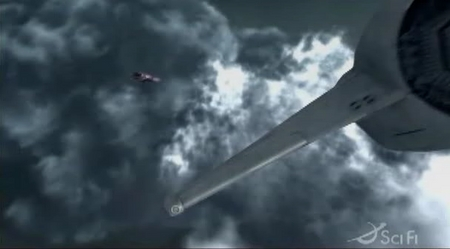
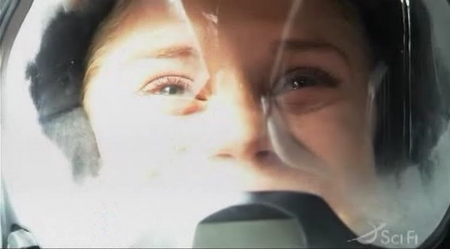
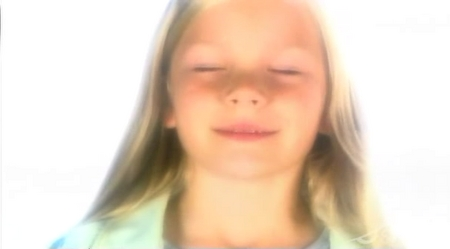
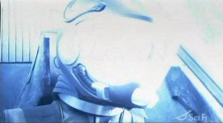
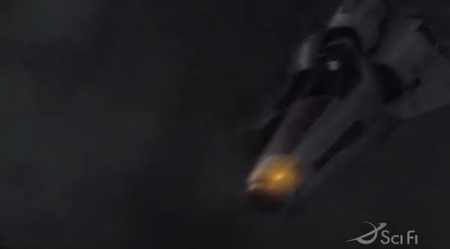
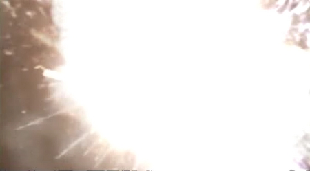

Back to: [West Karana](/posts/westkarana.md) > [2007](/posts/2007/westkarana.md) > [March](./westkarana.md)
# Battlestar Galactica, frame by frame

*Posted by Tipa on 2007-03-07 07:55:38*

What *really* happened at the end of Battlestar Galactica? Here's a frame-by-frame examination of the last few seconds. It's full of spoilers, so DO NOT read further unless you have seen the episode, "Maelstrom".

In this episode, Kara "Starbuck" Thrace is haunted by visions that she is on the verge of a greater destiny. She comes to terms with the memories of her abusive mother and then deliberately dives into the eye of a storm on a gas giant that looks (to her) like the mandala she has been seeing since she was a child. Her ship explodes -- but was she in it?

I don't think she died. I think something *else* happened to her. Here's frames from the last few seconds.

This is a view from Apollo's ship. See the Cylon heavy raider at the upper left, that he does not appear to notice. This is the first time we see the raider from anyone else's perspective than Starbuck's, and is the first time we know she isn't dreaming it. Moments later he noses down and Starbuck's viper comes into view.

Kara tells Lee to let her go as light fills the cabin.

She closes her eyes and sees herself as a child, at peace. Cylons, by the way, don't have childhoods. Kara is not a Cylon.

Kara disappears in a sudden flash of light.

Kara's Viper (notice that the cockpit is empty; Viper pilots wear lit helmets easily seen from outside) begins to burn up and soon explodes.

Simplest explanation is that Starbuck transcends her human/mortal existence somehow. The Five have been shown as beings of light, and the original Starbuck himself had a similar transformation into a [being of Light](http://en.wikipedia.org/wiki/Ship_of_Lights). The current producers of Battlestar Galactica have time and again brought back plot elements from the original show in unexpected ways.

It's *my* wild speculation that Kara will continue through the eye of the storm and come to Earth transfigured, similar to Dave Bowman's transfiguration into the Star Child in "2001: A Space Odyssey".

I guess we'll see at the season finale...
