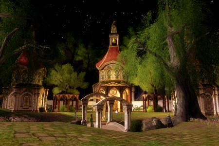
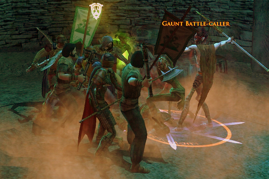
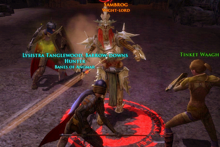
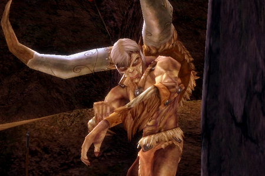
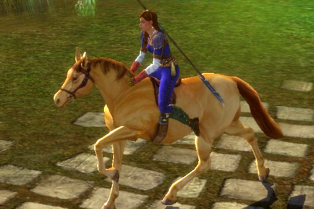

Back to: [West Karana](/posts/westkarana.md) > [2007](/posts/2007/westkarana.md) > [May](./westkarana.md)
# LotRO: The Song of Lysistra

*Posted by Tipa on 2007-05-03 17:21:09*

*Young Frodo, to you has fallen the most perilous task. You must bring the Ring to Mordor. But first, kill twenty boars and bring me their tusks. I will also require their hooves, but I won't tell you that until you get back with the tusks.*

Oh! Young Lysistra is come out of the West,
Through all Ered Luin her blade was the best;
And save her good Halberd, she weapons had none.
She ran with good fellows and she ran alone
So faithful in love and so dauntless in War,
There ne'er was a Captain like brave Lysistra

She stayed not for wolf and she stayed not for crow;
She swam the Withywindle where river ran low.
But ere she alighted at Brandywine gate
The group was departing; the Captain came late
For a shifty elf Hunter they'd met at the bar
Had taken the spot promised good Lysistra.

So boldly she entered Brandybuck Hall;
'mongst Guardians, and Minstrels, and Burglars and all;
Then spake the group leader, his hand on his sword;
For the craven elf Hunter said never a word,
"Oh! Come you to curse us, or come you to spar,
Or come you to bid us fare well, Lysistra?"

"I sent you five tells, my pleas you denied;
We leave in ten seconds, you brusquely replied.
And now I have come, with this herald of mine,
To eat roast crebain, to drink dwarven wine.
There are groups in the North Downs more able by far
That would gladly invite Captain Lysistra."

The Hunter poured wine to a tall silver cup,
Lysistra smiled sadly as she took it up
And turned it over on the elf's silver head
The elf gripped the table, his pale eyes turned red
"You've angered your better, you will meet Arultar
Or hast courage failed you, thy frail 'Lysistra'?"

"I could never fight so unworthy a foe,"
She summoned her herald and started to go
"But in some far land should I see you draw nigh;
Do fear my Halberd for you will surely die"
"I have no need to wait, I need not travel far,
My arrows hunger for your blood, Lysistra."

One cut to his hand and one slash to his ear,
The Hunter cowered and shook in his fear
He ran cross the room and he unslung his bow
And pulled back a grim Mordor-make arrow
"Braver I am when my enemy is far
Meet thou thy Maker, mortal Lysistra"

The fell shaft went flying, it hungered for blood
And flew unerring where Lysistra stood
The arrow found its mark and it burrowed deep
And sent its target to an unending sleep
An anguish-drenched cry could be heard from afar;
The doughty young herald died for his Lysistra.

She took up her banner, she took up her blade,
She took up the battle, and death there she made
She met Arultar's sword with a terrible blow
Her steel cut through all and she brought down her foe
"Now shall I ne'er walk with the blessed Valar,
My spirit shall linger with the cursed Lysistra"

The courageous young Captain said never a word
She laid her herald to rest with his hands on his sword
The Captain rode West and was not see again
In the lands that cradled the corpse of her friend
Though travel you near or travel you far
Pray you ne'er draw the anger of young Lysistra.

* Gormabrand of Windfolia contributed "I will also require their hooves..." to the opening, which made it a dozen times funnier. My sincerest and most humble apologies to Sir Walter Scott for, um, "borrowing" a possibly recognizable bit of *Marmion* for my own evil purposes. And lastly, apologies to my friend Arultar for making him the villain of the piece. Good thing he doesn't read my blog often.

* Pictures: (1) Elf village near Angmar in North Downs. (2) Fighting in the Great Barrows. (3) Battling the Wight-Lord in the Great Barrows. (4) Earthkin in the Lone-Lands. (5) Just... Lys on a horse...

