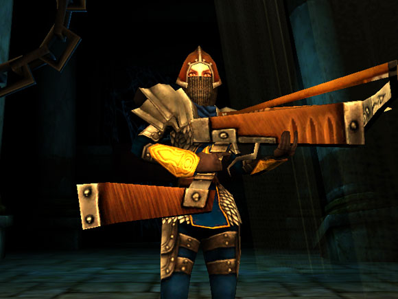
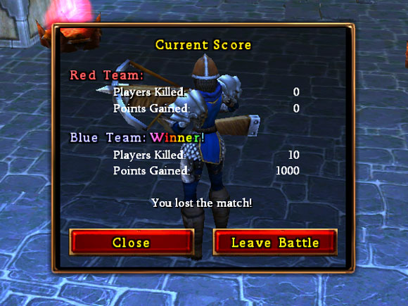

# Dungeon Runners -- Now with cool PvP added

*Posted by Tipa on 2007-11-04 14:52:47*

  
*Ranger Tipa reporting for duty!*

I've kinda been avoiding Dungeon Runners' PvP server. Not because I suck at PvP -- which I do, but not because of that. Because I just felt it wouldn't be fair, me, a low level character, going up against high level people with the best gear.

The [latest patch notes](http://www.dungeonrunners.com/news/2007/10/server_downtime_13.html), though, hinted at some changes:

> During PvP battles, everyone is “magically” rebalanced to make the battles much fairer. Each player will have their health and damage boosted to what it would be for a level 101 player of their build.

Hmmm... Interesting! So everyone will be made the same effective level, and their power adjusted based on team size? Sounds good. I logged on and did a couple of levels of a dungeon to get back in the swing, then logged into the PvP server (your character follows you from server to server) and signed up for a match.

Almost immediately, I was paired up with Drakn, who was *also* a ranger! Good match! My level zipped to 100 and I was feeling pretty buff.

That lasted up until I actually ran into him...

It was a pretty one-sided fight. Me with rather ordinary armor and weapons vs someone with the best. And though we were the same effective level, he had more abilities at his command, and his gear was far, far better.

I understand that there's never going to be a match-up where gear doesn't matter, but it sort of raises the bar to compete in 1v1 PvP to those people who have superb gear. People playing for free will simply not be able to bring the appropriate gear to the battle, though they may have a place to play in team-based PvP.

  
*Brownie, you're doing a heck of a job*

Until the gear gets balanced the same way levels do... if you're not wearing purples or better, you might want to stick to orc-slicing.

