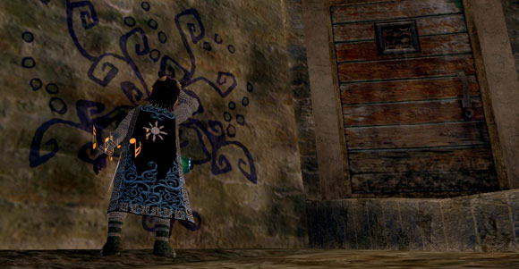
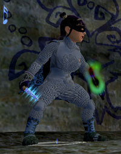

Back to: [West Karana](/posts/westkarana.md) > [2007](/posts/2007/westkarana.md) > [November](./westkarana.md)
# EQ2: Rambling on...

*Posted by Tipa on 2007-11-05 00:53:19*

  
*Those who write on Freeport walls, roll their...*

I'm in a little bit of a funk regarding EQ2 at the moment. Not the game -- no, the game is great. It's me. And it's other people. These sorts of games are social games, and if the social isn't working, the game isn't working.

 The guild I'm in is having problems. It has been having problems for awhile. There is room for only so many raiding guilds on any particular server, and we were number one, once; now we're number ten, maybe lower.

It's hard to get people to join who will stay. I know how this story ends; Crimson Eternity on EQ1 ended the same way. Recruit all you like, but once a guild has lost its momentum, it's impossible to get it back. Sure, we have people coming back for Kunark -- they are joining other guilds.

It's kind of a bummer.

My son and I are discussing what to do, after Kunark comes out and we level to 80. The personal ties that kept me in Crimson Eternity long after it was clear our time had passed aren't so strong in Eternal Chaos. I don't want to let anyone down, but logging in for Labs is just depressing.

Oh yeah, I got a new knife in Clockwork Menace tonight (inset picture). We raided Cheldrak and CWM jointly with another guild with whom we might merge or absorb. It was nice to be raiding again. The proof would be FTH, EH and MMIS. Clear those, and I will be nothing but happy staying right where I am.

Appearance armor is that junk armor from HoF, Stygian Chain.

