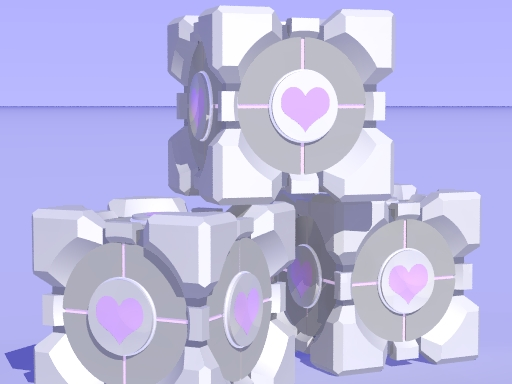
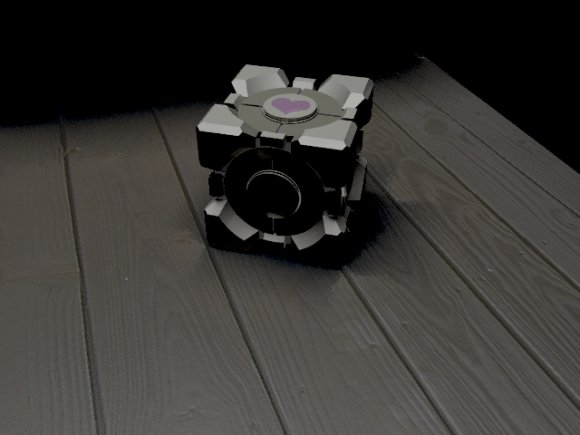

# Final Weighted Companion Cube model

*Posted by Tipa on 2007-11-04 08:31:24*

Woke up early this morning due to the time change, so I thought I'd correct my Weighted Companion Cube model... here it is, rendered with radiosity (realistic lighting) in Povray.

Experimenting with lighting, texture maps and bump maps (the wood floor is from a picture I snapped with my digital camera. I used GIMP to normalize it.)
