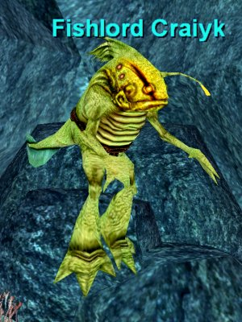

Back to: [West Karana](/posts/westkarana.md) > [2007](/posts/2007/westkarana.md) > [October](./westkarana.md)
# The Deep Ones

*Posted by Tipa on 2007-10-12 12:24:28*

> And yet I saw them in a limitless stream - flopping, hopping, croaking, bleating - urging inhumanly through the spectral moonlight in a grotesque, malignant saraband of fantastic nightmare. And some of them had tall tiaras of that nameless whitish-gold metal ... and some were strangely robed ... and one, who led the way, was clad in a ghoulishly humped black coat and striped trousers, and had a man's felt hat perched on the shapeless thing that answered for a head.

Murlocs... vile creatures of the deep who walk on land in a twisted parody of humanity... H.P. Lovecraft wrote, years ago in his story "Shadow over Innsmouth" of the Deep Ones, fish-like creatures who promised the townsfolk of that coastal Massachusetts town immortality and good fishing in exchange for sacrifices on the 30th of May and the 31st of October.

Oh yes, and their very souls. As the residents of Innsmouth aged, they would look more and more fish like, eventually joining their un-aging, un-breathing brethren beneath the gray waters.

I caught a glimpse of one in a Kunark preview interview... I had not remembered them from Kunark in EQ1, but I thought I'd go back and see if I could find them there.

I woke up my gnome mage, Tsuki, and brought her to Veksar, the ancient city sunk beneath the still waters of the Lake of Ill Omen. LoIO will be in EQ2, I knew, and where else to seek Deep Ones first?

Watery goblins tried to stop me, but my fire pet took quick care of him (my pet didn't seem to have any trouble under water).

Veksar has a lot of memories for me, mostly bad ones. I must have spent two weeks there solid with my cleric, camping the same several mobs. The trains, the people yelling over the camps, ganking, overpulling... all the good-old times of EQ1.

Last night, there was just me and a level 75 frog warrior, who, as I moved through to the deeper parts of the zone, informed me he was camping the courtyard.

It's okay. I don't want your stinky goblins anyway. I'm looking for the worshipers of Dagon. And they will have your hide for a handkerchief. Oh yes.

My fire pet had fun killing the undead I stumbled into as I had fun overnuking and fleeing for my life skillfully kiting. It's been so long since I played. In the end I did have to run back to the courtyard, where goblins had started to respawn. There was the frog, why wasn't he killing these?

Oh yes, he was waiting for me to *die*. Hmmph. This is so typical of Stromm server. NO other server ever attracted such horrible people. I'm glad I moved my cleric back to Erollisi Marr. Not willing to give him satisfaction (my pet was doing a wonderful job but even it could only do so much), I fled the zone, back to the more still waters of the Lake.

> I think their predominant colour was a greyish-green, though they had white bellies. They were mostly shiny and slippery, but the ridges of their backs were scaly. Their forms vaguely suggested the anthropoid, while their heads were the heads of fish, with prodigious bulging eyes that never closed. At the sides of their necks were palpitating gills, and their long paws were webbed. They hopped irregularly, sometimes on two legs and sometimes on four. I was somehow glad that they had no more than four limbs. Their croaking, baying voices, clearly wed tar articulate speech, held all the dark shades of expression which their staring faces lacked.

I next tried the Plane of Water. Surely, somewhere in those depths, if anywhere, we'd find them. And, quite deep, I did. Two Fishlords. And it wouldn't take hardly any effort at all to kill them. Would they gurble as they died... or run away to get friends... I don't know, I left them alone. The Plane of Water has never been a fantastic spot to solo (and I remember that killing these guys start a one-group ring event).

My memory wasn't bad, after all. Murlocs -- Deep Ones -- were indeed in EQ1. They came with the Planes of Power. These particular ones were also found in the Plane of Nightmare, and I'm not sure, but I wouldn't be surprised to find them in the Plane of Disease either.

But they *weren't* in Kunark... not at that time, anyway. Why are planar denizens prowling around Kunark?

I imagine we'll find out next month.
 

 

*Water, water, every where,
And all the boards did shrink ;
Water, water, every where,
Nor any drop to drink.*

*The very deep did rot : O Christ !
That ever this should be !
Yea, slimy things did crawl with legs
Upon the slimy sea.*

*About, about, in reel and rout*
 *The death-fires danced at night ;*
 *The water, like a witch's oils,*
*Burnt green, and blue and white.*
 

 

 

