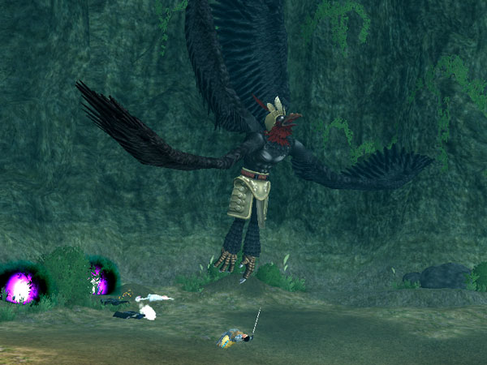
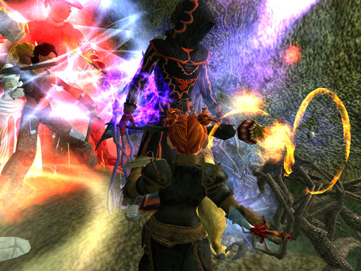

Back to: [West Karana](/posts/westkarana.md) > [2007](/posts/2007/westkarana.md) > [October](./westkarana.md)
# EQ2: The crows come home to roost

*Posted by Tipa on 2007-10-13 09:10:23*

This was all part of our "execution strategy". Carefully arrange ourselves *beneath* him, with our weapons all pointed up, then when he gets tired and lands, WHAM! Death of a thousand needles, we rez and we loot.

It was *just crazy enough to work.*

Okay, we really didn't think we were going to roll in their with twelve eleven random people and kill Xux'liao (yeah, I looked up his name...), but given we'd just spent a night getting access to the place, seemed worth a look.

And didn't I just know I'd be asked to bring my Inquisitor... well heck, she does 380 dps -- not bad for an alt, though raid geared inquisitors can do 1K dps and still heal -- but it was fun. A plate healer hat dropped off a mini-named along the way and the templar in the raid either had it or didn't want it, so I got it.

We learned a lot about the boss fight. I learned, for instance, that keeping my group alive would take all my time. Finding a way to avoid the boss' AE will be key to killing him. And we needed loads more dps.
