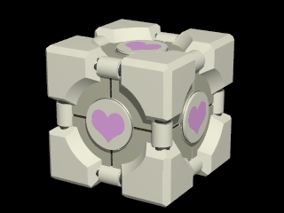

Back to: [West Karana](/posts/westkarana.md) > [2007](/posts/2007/westkarana.md) > [October](./westkarana.md)
# The Weighted Companion Cube is your only friend.

*Posted by Tipa on 2007-10-30 00:34:19*

I was thinking... ya know, I'd like to do some fan art with Portal's Weighted Companion Cube, but I couldn't find a model of one that worked with a modeler I could afford -- i.e., a free one. So I did my own from scratch with the Persistence of Vision ray tracer.

I haven't put in any textures yet... but I think it came out rather well for an hour's work.

Edit: Finished the model. Not perfect... close....

For Povray modelers, here's the scene file for the final cube:

[Weighted Companion Cube Povray scene file](../../../uploads/2007/10/wcc.zip "Weighted Companion Cube Povray scene file")
## Comments!

---

**Tipa** writes: Simplified the model in advance of texturing this morning, and applied some quick textures just for testing. I have to fix the model for the struts -- in game they have a flared and beveled collar. Not really noticeable unless it isn't there. The whole WCC was sculpted to make it more organic.

I doubt the developers use CSG (Constructive Solid Geometry) for the actual object. CSG objects are made by adding and subtracting geometric solids, like cubes, spheres and cones, and are notoriously slow to render. Games use models that have been exported as meshes, then use textures, bump maps and normal maps to add detail.

I haven't worked with that stuff since I did a presentation for AstraZeneca back in the 90s, using Inspire 3D. There's a game I want to write for Areae's MetaPlace that will use 3D animation, and I'll want to use more traditional mesh geometry for those objects, so maybe I'll see if I can mesh this up using Blender or some other free 3D modeler.

But first to finish it using CSG.

It's amazing to have a chance to really examine a game object like this in depth. This isn't white; it's cream, a warmer color by far. There's very little contrast between the different parts. The object is designed and colored to seem natural and organic, which is just what you want, given the WCC's role in the Portal story. An object you can accept as being, in some way, alive.

---

**Tipa** writes: Notes on finished model: I actually did the entire model based on the screenshot I took at the start of level 17 (I'm up to 19 now). So when I actually logged on to play level 17 -- the WCC level -- last night, I got a lot closer to it and noticed some substantial differences between my model and reality -- the struts are actually trim, are curved by the same conic cutout that curves the corners, and the shiny metal along the edges is just... shiny metal along the edges, not a metal rod. Also the inner core material (seen between the seams but difficult/impossible to see in my screenshot of the finished model) is pink, not brown. The seal with the heart is slightly curved. I actually knew that, but I couldn't get my solution -- using a squished superellipsoid -- to work properly, so I just used a cylinder capped by a disc for image mapping reasons. I'll probably either lathe it (unlikely because I have to map the heart onto it) or use a surface of revolution. There is also some detailing to the textures used in the Portal model which I may or may not worry about. A XNA model I found online used texture mapping extensively, whereas I only have one mapped texture, the heart.

After I finish WCC 2.0, I have some plans for the WCC...

