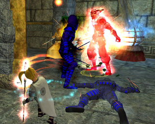

# EQ2: Nothing special.

*Posted by Tipa on 2008-03-07 08:52:01*

There's nothing special about this picture... except that it shows why EQ2 is so great.

After last night's raid, I'd logged in my jeweler, Dorah, to make a mirror for a guildie. And then, what the heck, as long as I am on, I'll make some new combat arts for my long-ignored brigand, Donna (if it's a halfling, and an evil-only class, and name begins with 'D' and ends with 'ah' -- it's probably one of mine... Dina, Dera, Donna, Dorah...). I sent them off, logged Donna in after a bit and picked them up, scribed them, and just for the heck of it as I was arranging my "tank" and "rogue" hot bars (one for each of a brigand's roles), I said "29 brigand LFG!" in 20s chat and IMMEDIATELY got a group invite.

So I bought some poisons and headed to Crushbone Keep (from Freeport... LONG trip when you don't have the GFay druid ring).

I get there (eventually) and we spend the next couple of hours just tearing the place apart. Two levels, an AA point, lots of treasure, lots of fun, a few very scary moments... yeah, this was nothing special. Just another night of EverQuest, grouping, meeting and beating challenges, living on the edge and having fun.

Just exactly the sort of thing I loved EQ1 for, and, sadly, the thing I could only rarely find in WoW (though it was fun when it did happen). If a game wants to lure me from EQ2, it's going to have to provide this kind of gameplay -- but better. Maybe Champions Online will do that.

It was fun being the top DPSer for once. I play so many support classes...

