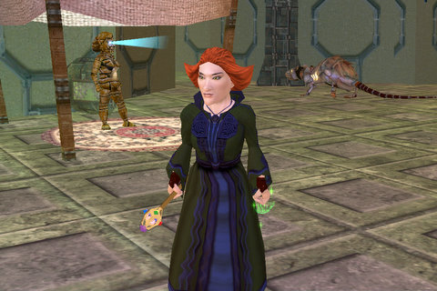

# EQ: Tsuki (Oyasumi Nasai)

*Posted by Tipa on 2008-04-10 00:09:14*

That was a crappy picture of my EQ1 mage in the Shard of Hate article, so I logged back into EQ and took a better picture. There's her epic that I spent so much time camping. The robe is the Fabled Robe of the Ishva that I camped along with a lot of other people the first or second year of Fableds. It's weird, but now that I think back on it, usually around Fabled season I was not playing EQ. It was very cyclical for me. The green glowy on her off hand I got from some BoT tower boss -- I believe the air one.

She started off on Erollisi Marr and got her epic there, but in the meantime, I had restarted on the Stromm server, when it opened, as a cleric. SOE didn't allow people to transfer on or off Stromm, so she was kind of stuck. Finally they opened transfers ON to Stromm, but not off (because, I believe, we had too much old Sleeper's Tomb loot). So I moved Tsuki to Stromm to help my cleric with some of her solo quests and random leveling. Then when they allowed transfers off Stromm, I moved my cleric to Erollisi Marr and rejoined my old guild with her, but Tsuki was left stranded on Stromm. For awhile she was able to go on Plane of Fire raids with my old guild but that eventually petered out.

I loved playing her. My EQ2 necro, Dorah, was made in her memory. Of course, Dorah is a halfling, not a gnome. People would rib me for playing a gnome instead of a halfling, and I'd tell them, if halflings could be mages, she'd have been one. EQ2 DID allow it, and so she was.

Tsuki was my first alt. My main at the time, Etha, a halfling druid, was doing okay, but I felt I was working too hard for my experience. I started a mage and found out I was right. Etha could hardly ever get groups past her late 40s. I spent hours root rotting drolvargs in the Dreadlands, quad-kiting yetis there too, and dealing mass death to the spirocs in Timorous Deep. I soloed pretty regularly with her until 54 or 55, when I joined Divine Grace and was able to get guild groups. She never did make a level cap. Etha got to 63 before she left DG when I changed mains to my rogue, Tipa.

Back in the good old days, you didn't need to be at a level cap to be in a top raiding guild! That's inconceivable these days!

