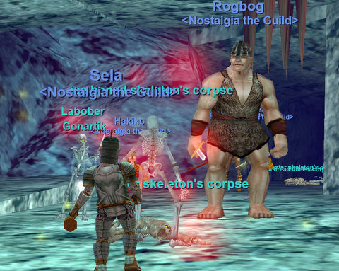
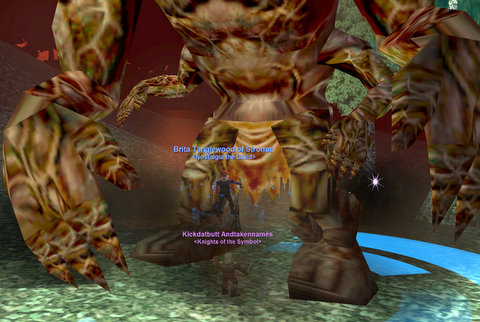

# EQ: The Nights of Befallen

*Posted by Tipa on 2008-05-07 08:13:27*

The Friday progression group is pretty hot stuff, but leveling in EverQuest is so fast now that we quickly leveled past a lot of low level content that we really wanted to see. The only cure? More cowbell. Another progression group! Hakiko couldn't make the Friday progression group, so he went ahead and made another for Tuesdays. I simply couldn't resist. I rolled a pally, and with the help of a guildy and some others, finished the tutorial missions for the last of my armor, and then headed off to the dungeon, Befallen.

Befallen is by far the greatest challenge I've met so far in this game. You don't pull singles. You pull dozens. We must have had four complete wipes in there -- those old joys of corpse runs, we did those. Darting down the stairs looking for our gear... trying to fight things naked... bunches of fun -- but in a GOOD way. Modern games have zero risk -- none whatsoever. 

I wish we'd had a rogue. though. Losing our keys each time we died plus not being able to easily grab our gear made things insanely tough.

Even with all the deaths, I went from level ten to level 15. Next week: Paludal Caverns!

Afterward, I logged on to my cleric to help Kuron and a couple of his friends clear Fear and kill Cazic-Thule. No golems popped, though, so no ball of golem clay for everyone's favorite beard-adorned trashcan. :(

