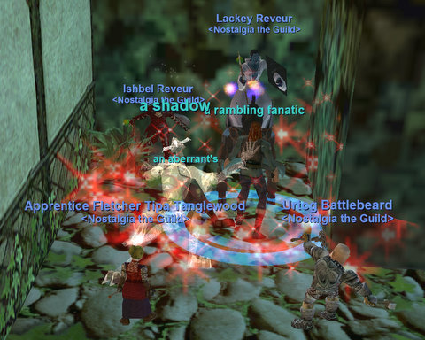
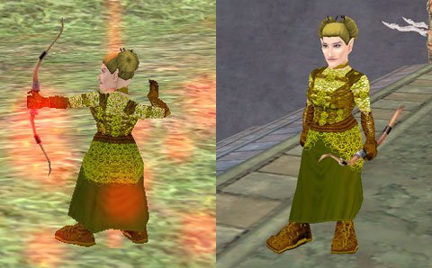

# City of Mist

*Posted by Tipa on 2008-05-27 08:17:57*

We didn't come anywhere near our level cap Friday, as Mistmoore Castle turned out to be pretty tough. Saturday, a few of us were on, not doing much, so we decided to just DO something. And so we did probably about the most boring thing you could think of -- we went to a zone, broke a camp, and stayed there and chatted and just had fun for the rest of the night. In the end, it was probably my most ... nostalgic ... moment since I returned to EverQuest.

The zone was the City of Mist, in the Emerald Jungle. The camp was the stables, one of the most coveted camps for experience groups Back In The Day. A named pops there, and gave our cleric, Ishbel, a fancy new shield. Lackey, our mage, also got a shield of some sort (not as nice, though). No notable loot aside from that, but once Urtog figured out the spawns and we got the camp nice and broken, we were in the zone and it was the standard EQ camp from then on.

On Nostalgia nights, we tend to crawl through dungeons. This was not the typical way of playing EverQuest. Usually you fought your way to someplace you liked, and you STAYED there. The puller would pull, the tank would grab the aggro, and everyone would pile on. But that sort of play has fallen out of fashion, and I believe EverQuest is still the only MMO that offers this sort of casual, extremely social, style of play.

I have long thought that all the things people count as bad points in EQ, are actually good points -- if you are with the right sort of people. MMO devs were far too quick to blithely toss out what was good about EQ. And now people will never know, unless they play.

Sunday I was putting stuff in the guild bank with Brita, my 75 cleric, when I got a tell from a monk asking to help him on his final fight for his epic 2.0. Naturally, I said I'd be right there. The fight was on the aviak island in the Ocean of Tears. The fight is meant for two groups, but can be done with one. The group was made of people from between 70 and 80. One person didn't get to the fight in time, so we did it with five -- monk, cleric (me!), shaman, warrior, warrior.

He's the fun bit, and why EQ is EQ.

Nobody was exactly sure what happened on the fight or what the mob would do, though they didn't think there would be adds. And so we just started it off.

Turns out he had a short-range AE rampage and a single target fear+stun. But not a word was spoken about those. Everyone seamlessly adapted to a fight they were learning as they went on, and after awhile, we won without a single death (and mana was okay too).

High level EQ players are professionals. They have played in groups nearly their entire time, they know their jobs, they are adaptable and expert at their jobs.

Take a standard high level EQ2 group. About half a pickup group will have no idea what to do. They clearly don't know their class. They don't assist, they don't cure, they don't use all their abilities... it's a mess. Or your standard WoW group. Everyone is sure they can solo everything, and so they don't even pretend to work together. They just go wherever, and blame the healer if they aren't kept alive. (I was that poor healer. It was INCREDIBLY frustrating to have people just wander off all the time, or a mage suddenly and without warning decide to jump into the middle of a group of mobs and start AEing while I was trying to heal the tank. But I digress.)

That cool competence is another thing I would love to see in other MMOs. But to get people to learn how to act as a team, games would have to encourage group play, and that notion has become radioactive to MMO devs. Encourage people to group? What is this MADNESS? MMO games are for SOLO players, dontcha know. SOE obviously thinks that now; the Rise of Kunark expansion proved that. I hope they don't mess with EQ.

I spent some time brewing up a couple stacks of armor dye Sunday. I wanted my ranger to have ranger-y colors, so I finally settlled on an outfit with shades of green and burnt orange that complemented the weird halfling chain armor model colors and looked fairly unique. In EQ, you come to recognize people by their armor designs, so everyone comes up with colors that are uniquely theirs. It took awhile to come up with a pattern that would look ranger-y -- tending toward green and brown -- but not monochrome.

I also worked fletching up to about 150, got my conjuration skill high enough to cast DoTs reliably, and did some weapon quests for decent weapons. I eventually went to the Bazaar for a 1HS, since my 1HS skill was falling behind.

Level 40 and beyond starts bringing rangers into their unique role, with short term buffs that greatly increase melee. I am still really happy with the abilities of the class, and regret not trying one sooner.

