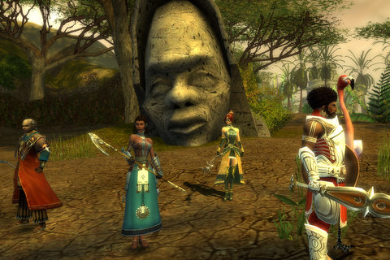
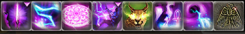
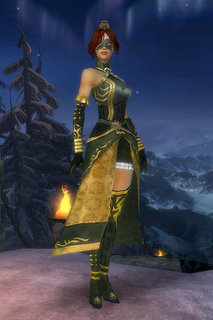

# Guild Wars: Nightfall, Day 1

*Posted by Tipa on 2008-08-04 07:50:19*

  
*In search of... Ancient Erudites...*

When a bunch of the most knowledgeable people in MMOs suggest to me that I should probably look into Guild Wars because it sounds like I need something different, well, I buy the game. And yeah, even though the game could be best compared to Dungeon Siege II with massively multiplayer cities, I do consider Guild Wars an MMO. Every city, town, hamlet, guard post and quest hub I came to were filled with people, selling stuff, looking for groups, looking for escorts to far away places, offering 100% no fail inscriptions -- it was alive in a way that only MMOs manage.

So, first day. I started off as a Mesmer, not knowing really what the class did but someone said "try Mesmer!" and so I did. Mesmers shut enemies down. If the monster tries to cast a spell, it hurts. If the monster tries to attack, it hurts. If a monster has a buff, it hurts (and is removed). If they stand around doing nothing, it hurts, but not as much. With elite skills (which I clearly don't have), Mesmers can prevent monsters from using a skill, or even take that skill away from you and use it against you. It's a pretty unique class, I've never played anything like it before. It does tend to infuriate monsters, so I am using the command window to send my heroes and minions ahead to get aggro before I start with the mesmering.

I chose Ranger as my secondary class, because of Franz Mesmer, the scientist who discovered "animal magnetism" (later called Mesmerization, and even later, Hypnosis). So it just seemed proper that I have an animal companion.

When I looked up my build (Me/R) on various Guild Wars sites, it wasn't listed at all. Those two classes don't work well together. But, they suggested, a Mesmer can do quite well without worrying about their secondary class. Push points into Domination so stuff hurts a LOT, and into Inspiration to regain some health and energy, and you'll make your mark.

So, until I do the respec quest and can change to a more conventional build, that's just what I've done. At level 12, I've put the vast amount of my points into Domination, with some in Inspiration and some in Fast Casting. And if I need to swap this around for specific missions, it's just as easy as visiting any non-instanced zone. I've done a little bit of traveling for skills.

There are games out there where you know just how and where to use a skill, and then you do that, over and over. Guild Wars is not that kind of game, and without the many, many wikis which teach you how to choose your skills and use them together, I would be entirely lost. And I want some of those higher level skills, which build upon each other to make cities of pain. I think City of Pain is a Mesmer skill, actually.

I chose to start GW with the Nightfall expansion, because that gave you heroes which leveled up with you, and for whom you could choose their skills and gear. You start off with the hero Koss, an out-and-out tank. He tanks the mobs so I don't have to. In fact, it gets to be such a furball of mobs most times that I don't WANT to play a melee. Standing off a bit making things hurt makes me happy. Of course, they come at me anyway... but every time they attack me, it hurts them so much I smile :) I went with healer and motivator (javelin-throwing) henchmen. As we leveled, I played with Koss' build a bit so he could better protect me and not worry so much about the damage. Next to come was a healer hero, and last, a disruptor hero. And not long after I had bid adieu to my last henchmen, my party size increased to eight and I was able to get them all back again as I headed to some truly awful killing fields.

Just going out and killing things won't get you much of anywhere in Guild Wars. Quests help (and are very often the same sort of kill X, run from here to there quests you see everywhere). Your rank in the Sunspears, the impartial, a-political guardians of the region, is a major plot driver. You gain rank not only by doing quests, but by talking to the scouts on guard outside resurrection shrines, who give you a bounty buff for a certain sort of enemy in the region. While you have that buff on (permanent until you zone), you will get double experience for enemies of that type, PLUS you gain rank in the Sunspears. So the first thing you do when entering the wilderness is look up the local scout and get the buff, and if you see anything matching it, you kill it. You can have multiple bounty buffs, so in larger wilderness zones, you might be running with two or three and really pulling in the bounty.

The wilderness zones are full of side quests so that you never find yourself setting off to do just one thing. In fact, it's incredibly easy to get distracted. Like, I'm supposed to be clearing this quarry of mobs, but this guy standing near a monument needs his tools. He doesn't want US to run off and get them, FOR ONCE. Instead, HE'LL run off and get them, all we have to do is just guard the monument until he returns. Easy money.

The moment he leaves, the lizard-like Skale decide to attack. Wave after wave after wave of scaley awesomeness. I still haven't survived that encounter. But combined with a Skale bounty buff, it's excellent xp and rank, until I die, anyway. There is a sort of debuff you get when dying, but since it's entirely cleared by just popping into the nearest town or outpost, it really only gets annoying when you're deep into a zone and you don't want to have to fight through all those monsters again.

There is a main plot to the game, which you pick up as you gain rank. Some evil queen wants to rule the world, and she wants the Sunspears out of the picture before the astronomical event known as Nightfall. Isaac Asimov once wrote a story about a planet with five suns, and once in several thousand years, they'd all end up on the wrong side of the planet and night would come and the stars would come out and civilization would collapse. I don't know if the GW Nightfall has anything to do with that. But they seem to just have the one sun. My best guess: an eclipse. Anyway, the first mission -- which can be repeated for better scores -- was to save a village from invasion. I did that with all mission objectives completed. The second mission was to delve into some ancient ruins, solve various puzzles, be under continuous attack and take down the monster Apocrypha, who, it turns out, was the only thing keeping the undead from invading the land (oops). One secondary objective was to not kill any Sunspear ghosts, but temporary-ally Koromir, local head of the Sunspears, didn't get the memo and attacked every one she saw. After the first one, I found you could just run away from them and Koromir would give up on it after awhile to follow. So I need to return and redo that one. These missions are full of cut scenes and remind me very much of the similar plotline missions in Final Fantasy XI Online.

Crafting is pretty complex, given you don't do it yourself. You bring raw materials, which can be found, bought, or salvaged from trash loot. One of the first things I did was change into a nicer looking outfit. Most stuff can have "inscriptions", which give some benefit to the armor or the weapon. You can remove the inscriptions from items that have them, giving the occasional piece of trash loot a value it otherwise wouldn't have. You can further supplement certain items with runes, so pretty much everything you (or your heroes) use or wear will eventually be specific to you and your needs.

And everything you unlock, be it runes, inscriptions, types of weapons or armor, will be available to you on any PvP character you make. Because the PvE game is only half the story. I haven't done PvP yet -- it starts at 20 -- but I have observed some matches. I bet the best teams know all about each others builds and work together for real pwnage. I'm not normally that into PvP, but this one seems based more on skill than items... might be worth a look.

And that was just the first day. Impressions? Most WoW-likes just give you little bits of the game at first, then gradually give you more, so that after a few months, you have it all. Guild Wars seems to take the opposite approach. Give you everything, VERY quickly (at level 12, I am more than halfway through the leveling process, and I think the pre-20 game really must be considered an extended tutorial). And then you spend the rest of your time in the game refining your play. And PvPing.

It's definitely a whole new game.

