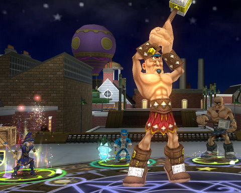

# Wizard 101 update

*Posted by Tipa on 2008-08-22 07:56:31*

Kid's MMO Wizard "Harry WHO?" 101 came out with a huge update yesterday. Even though I stopped playing the game much to avoid burning out before it goes live, it seemed a big enough deal to warrant stopping by.

The big news is the revenue model. It is likely that there will be a two-tier model for the game, with a certain amount of content available for those who play for free, and additional areas reserved for subscribers. It looks like the fee for subscribers will be about $10/month. Nothing has been announced officially, though, so it is all subject to change.

Enounter difficulty has been revamped once again. In my limited testing in Hyde Park in Marleybone, the mobs were higher rank -- rank 4 instead of rank 3 -- but weren't elite and came one at a time. This makes those fights significantly easier. 

Moo Shu, the highest level world currently released, was widely thought to be un-soloable by any level appropriate (30+) character. Combined with chained encounters containing thirty or more battles in Marleybone in order to unlock Moo Shu in the first place, a lot of players have gotten to Moo Shu only to give up in frustration. I'm not sure what the patch has done for them; I didn't see any friends on in Moo Shu so I couldn't check it out.

The real test would be to return to Krokotopia and try the Emperor's Throne Room instance again. That was broken the last time I tried it.

It's still a fun game. Now that it seems certain that it will cost some money to see everything, it's fair to ask if it's a $120/year-fun game? I can't answer that. My gut feeling is that there is not a year's worth of content in the game, and there is almost no replay value. If they keep the grueling, multi-battle instances as they are now, it would be hard to imagine anyone playing through it more than once.

It's definitely worth playing it through that once, though, perhaps re-subscribing as needed as they add new worlds.

