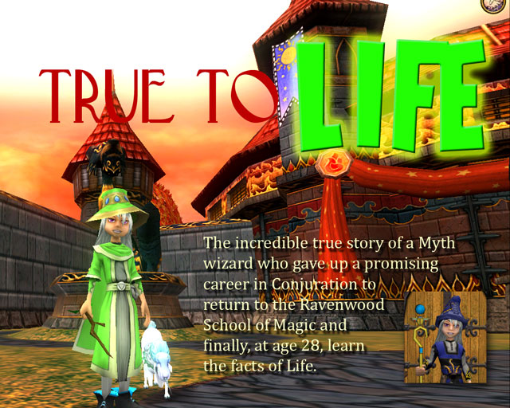
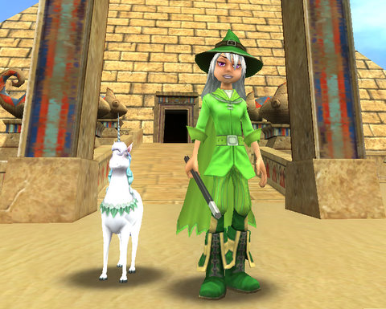

# Wizard 101 Live thoughts

*Posted by Tipa on 2008-09-06 18:04:30*

Wizard 101 went live days ago, but I've been insanely busy with real life lately (son going off to college and all), so I didn't get a chance to sit down and PLAY it, other than making my character and reserving the name, until this morning.

**The School of Life**

In beta, I was a Myth/Fire wizard. That wasn't the best combination, because it was all dps and no healing. What's worse, is that they were both high fizzle schools. Wizard 101 balances dps by adjusting the fizzle rate of your spells. DPS schools such as Storm and Ice do massive damage, but pay for it by fizzling up to 25% of the time. Support schools such as Life, Balance and Death fizzle much less, but don't hit quite so hard.

So the smart thing to do is to take a DPS school as primary, then back it up with a secondary support school. But seeing the huge, long long long fights in Marleybone and Moo Shu, I opted to flip it around and make Life my school, backing it up with Fire so I would have immense healing and decent dps.

With the old Myth/Fire combo, once I had used the three heals every character gets, I was out of the fight. EVERY W101 character MUST pick a support school with some healing (Life, Death) to complement a DPS school. Life is the school for people who intend to group a lot. Death is for soloers -- its heals are self-only.

So if you chose two DPS houses -- take my advice. Start over. You will be happier in the long run. If you want real fun, choose Balance as a your main school. It doesn't have heals, but you can absolutely shut your opponents down. A Balance/Life wizard would be the ultimate support combo. Medium dps, a selection of group heals, and think of the fun when the big bad boss monster can't make a single attack while the rest of your group brings it down.

Myth does have one thing I myth. Er, miss. And that's the minions. Summoning a companion to help even the numbers on some larger fights almost made up for the lack of healing.

**Merchants are not your friends**

In beta, I made the mistake of going to the various merchants, seeing what they had for sale, and actually *buying* that stuff, only to see it drop as loot again and again and again. The stuff merchants sell is overpriced and you WILL find better. You can get a sense of the true worth of a thing when you try to sell it back. You'll pay 16 gold for this? How nice. Do you remember selling it to me for 860 gold? No? You don't want to see the receipt?

Well, OKAY then.

  
*Oh yes, this is Tara in Krokotopia and in her new quest duds. And is she a Wizard City Protector? Yes, yes she is.*

There is only ONE vendor you need to see. And that is the one that sells decks. Decks drop rarely as loot (though some battles in the second world, Krokotopia, seem to drop them fairly commonly), and they determine how many spells you can have ready, how many you can have in reserve, and how many dupes you can have. A weak deck means a weak wizard. Get the best you can use at all times.

You might also want to stop by the wand vendor. It's useful to have a wand that casts magic from a different school than yours, so if you come up against mobs that resist your magics, you can always wand them to death. The starter wand is fairly weak. You can find starter wands from other schools as rare loot from battles in Unicorn Way. Wands drop fairly frequently in Marleybone (the third world), but you'll need to upgrade your starter well before then. Your primary school of magic also gives you a quest for one in your mid teens, but that is, of course, a wand in your own school, so not quite as useful.

My advice is to stick with your starter wand until Krokotopia, and then buy one there if you haven't found one in Wizard City. Krokotopia is a giant leap of difficulty higher than Wizard City, with the possible exception of Colossus Street, the zone where you are trained for Krokotopia, and Sunken City, which is harder than most of the encounters you will find until Moo Shu, for the level you get the quest.

Wands don't deplete your magic, cost no pips and are 100% reliable (unless you are facing Balance magic, anyway). You may have a deck full of showier spells, but your wand will never (well, see above) let you down.

Lastly, pets. Pets begin dropping rarely as loot from boss mobs in Krokotopia, and by the time you get to Moo Shu, you'll likely have several. They don't fight for you, but certain pets can grant you a new card for your deck. So if you're gonna blow your money on a pet, make it a pet that does something for you.

My unicorn, Millie, does not do anything for me. I got her because the group heal spell is cast by a unicorn, and I thought it kinda went with the profession.

On the other hand, because I don't buy stuff from vendors (aside from my level 10 deck), I have lots of gold.

**Prospector Zeke, the Item Shoppe**

As a beta tester, I got 600 free Crowns to spend at the Wizard 101 item shop. Aside from some level 5 gear of dubious quality, everything cost more than 600 Crowns. So they are mostly a teaser to get you to look at the item shop, look at your meager supply of Crowns, and rush to the web site to buy more.

2500 Crowns will run you $5. 5000 costs $10. $12500 Crowns is $25 (plus 1250 Crowns FREE!). Well, they say that. I call it $13750 Crowns for $25. But that's just me. And so on and so on until you get to 40000 Crowns for $80 (plus 20000 Crowns FREE!). (So, can I just have the FREE Crowns? Because FREE!! to me means, I don't pay money for it.)

Anyone who actually buys the level 5 item shop garb is an idiot. Sorry if you did, and think I'm picking on you. But you're going to hit the level 10 stuff maybe two hours later. Sure, the stuff is better, but as long as you're in Wizard City, the fights just aren't going to be all that hard, and usually there will be plenty of people to help. If not, just switch realms :) but more on that later.

In beta, when they gave us a bunch of Crowns to try out, I bought the level 25 outfit. And it was SIGNIFICANTLY better than the stuff I had on, most of it from Marleybone. If you're going to pay for better gear with real money, at least wait until it would do you the most good. Even with the better gear, btw, I couldn't solo the Emperor's Throne Room in the Temple of Storms at 28. Good gear won't overcome a bad spec.

I'm not averse to RMT, but I'll wait until 20 or so and then see if I am doing poorly enough that I need a boost from uber cash gear. It's not something you will be wanting to buy every five levels.

**Building a Deck**

If you aren't rebuilding your deck every time you move into a new area, you're DOING IT WRONG and you're making yourself look foolish to your group mates. The mobs have little icons showing their major school of magic. So you can get an idea for what sort of spells they may be weak to. Mobs also pretty much know what they are weak to, and often have defenses to protect themselves. If they are the same school as YOU are, swap out your wand and severely de-emphasize your primary attacks in your deck to focus on your secondary school.

There are several different kinds of cards in your deck. Direct damage cards -- your bread and butter. Resist buffs -- VERY IMPORTANT that you can reduce the damage you take from boss mobs. Auras that increase the power of your attacks. Debuffs that decrease the power of enemy attacks or increase the effect of your spells on them. Prisms and mutation spells that change the school of your magic. Spells that make a certain school of magic more powerful for an entire battle. Damage over time spells. Healing spells. Healing over time spells. Minions. Spells that damage every opponent.

I guarantee, you don't have room in your deck for every kind of spell you have. And if you try, you'll always be madly discarding cards to find the ones you need. And then you're gonna run out of cards. So, look at where you are and what you are fighting, and who you are fighting with, and build your deck accordingly.

Here's a little trick, though. If you want to make sure you always have some quick dps cards you can play when your hand is full of non-dps cards, go to your local librarian and buy some power cards. They look like a clenched fist, with a modifier, like +25 for the one in the Wizard City library. Fill up your treasure card tray with those. Next time you're in a fight and have some spare dps cards, draw a power card, merge it with a dps card -- which turns it into the Treasured variety of that card, usually with more damage and less fizzle -- and just discard it or not play it. Keep doing it until you have a full tray of absolutely instantly available, low fizzle, high damage cards that you can pull out and use anytime you need.

It can get expensive to do that too often, but it's just the thing to have for emergencies. Also, use the treasure cards that you get as loot. They don't do anyone any good filling up your card book.

And just a note about Myth minions: Don't be a noob. Wait until you have done some damage to mobs to pull out the minion. Otherwise, the mob will just one-shot your minion and you will have wasted 1-4 pips for nothing.

And a note about Life school heals over times: Don't be a noob. If you're a Life wizard and you're soloing, cast it on yourself before you need healing. If you are in a group and one guy has al the aggro, don't wait until he is < 100 points before you cast it. Do it right away.

And for the DoTs of the other schools: Way more important to get those cast at the START of the battle than at the END. Think about it.

**Realms**

There's a half dozen or so servers, from the crowded, Ambrose, to the newest, Wu. You can switch between them at will whenever you're not in battle, so if you'd like to group up somewhere, you can switch realms until you find other people there, too. I was on the Wu server, doing Firecat Alley. Not a tough zone really, but you need to kill quite a lot of stuff there, and my secondary, dps, school is Fire, so it wasn't the best match for me. I met just two other players there the entire time I was there. I switched realms to Ambrose, the street was CROWDED, I finished up all my kill ten rats quests and went back to Wu so I could loot all the wooden chests that spawn to give me, and only me on Wu server, gold. Pro tip/possible exploit: Since chests spawn in the same places on all realms, you can find a spawn and then flip through the other realms and loot it many times :)

Not that I did it. Aside from testing.

**If I had to do it all over again...**

This is my second time through the leveling process, and aside from the change of primary school, is 100% identical to my first time through. People on Ambrose are already through Krokotopia and probably hitting Marleybone already -- but there's no accounting for that sort of person who powers through. But even casual players will be seeing Moo Shu in a couple of months. KingsIsle ups the challenge of later levels by giving monsters insane amounts of health, so the battles that took a minute in Unicorn Way are taking fifteen minutes at level 35. So the battles are much, much longer, but the game play is pretty much the same. The card game at the heart of Wizard 101 is ALL THERE IS TO DO. Well, that and model different outfits.

But it's the kind of thing you only do once. If I had stayed playing the beta and gotten to Moo Shu, I most likely would not be a subscriber today. This is the reason I stopped playing once I got to Marleybone and did a few of the quests. They promise to add things like housing and PvP, but the PvP will just be the card battle again, and you can get a taste of how THAT is at the dueling arena in Unicorn Way.

**Other Players**

The vast majority of the players I see have the little icon which means they are underage and can't be freely spoken to. You have to use a menu-driven interface to say things, and those menus are entirely inadequate for teaching someone how to play the game. In fact, I don't remember seeing a menu selection for "Why are you using a 400 point heal to heal your 100 points of damage instead of finishing off the mob with a wand nuke? Why are you buffing everyone in the group against damage that the monsters we are facing don't dish out? And why are you wasting power pips by casting spells outside your primary school? HUH?"

It's not anyone's FAULT, it's a game with its own rules and strategies. But unless people stumble upon posts like this one, they just can't know. The facts are, the card game at the heart of the game is deep and strategic, and if you can't play it -- and can't figure out how to play it -- you will find that despite all the cartoony, kiddie trappings, you're just going to be a liability to the people around you and will not be able to solo effectively.

**So, in summary...**

Wizard 101 is a kid's game built around a Magic: The Gathering-level card game. It would have been better to keep the card game very simple so that kids could actually play it, or go for the late teen-young adult market that WoW aims for.

If they REALLY had wanted to make a Harry Potter-ish game, there'd be Quidditch, Beast Handling, Potions and Defense Against the Dark Arts. And Flue Travel. By slamming W101 to the GAME side of the GAME<-->SANDBOX spectrum, they have mimssed an opportunity to make the kind of fully fleshed out world that Harry Potter fans would really expect from this kind of MMO.

If you like the Wizard 101 card game, you'll be happy. If you don't -- write to J. K. Rowling and ask her when the Potter MMO is coming out, because there is nothing in Wizard 101 for you.

Me? I like the card game! And I like dressing up my character! So this IS the kind of game for me.

