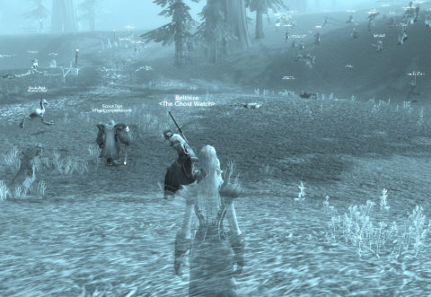

# Straight Talk Warhammer: Realm vs Realm

*Posted by Tipa on 2008-09-17 08:00:54*

Hey, welcome back to the second in our exclusive series about the exciting innovative gameplay of Mythic's Warhammer Online: Age of Reckoning. 

Public quests, [open groups](http://www.tentonhamster.com/node/1988), the excitement of the [Tome of Knowledge](http://lotrovault.ign.com/View.php?view=Guides.Detail&id=14), all things never seen before the evil geniuses at Mythic brewed them up in [charmed cauldrons](http://www.baconlinks.com/VVILL/MacbethsWitches.htm) on some fog-shrouded Scottish moor, with the witch-goddess Hecate shrieking over it. 

It's a well-known fact that the color red in the game packaging is made from blood.

It's true. [Look it up](http://www.snopes.com/music/artists/kissblood.asp). Because that's just how hardcore they are. They do it for YOU.

  
*Simulated Warhammer screenshot*

What IS Realm vs Realm and how is it different from PvP?

How about seventeen factions, any of which would happily crush the throats of the others? You can only trust your own kind. Maybe. That's war everywhere. That's Warhammer... the miniatures game. Oops. Wrong one.

Well, imagine FOUR factions, at each other's throats. In their own lands they are only somewhat safe, but step outside or into a contested zone and BAM! Constantly shifting alliances, places you just can't go and... oh wait, that was EverQuest. Evil vs Humans vs Elves vs Shorties.

Okay, but with four factions you get stalemate, so that's pretty boring. Three factions, though -- the two weaker against the strong one so nobody can ever rest at the top, never able to rest, that's... oh, never mind. That's Dark Age of Camelot -- or Planetside.

Well, how about two sides? Good vs Evil? Horde vs Alliance? That's the Realm vs Realm difference. That's why it's not simply "Player vs Player". That's what you can only find in Warhammer Online: Age of Reckoning. Along with public quests, the Tome of Knowledge, and open groups, the fight of good vs evil, free people vs the minions of Mordor, it's your realm against the other realm.

And the stakes are incredibly high. Everything you do moves the battle to one side or another. And when you finally have done enough to tip the balance forever to your side -- that's when the whole thing resets because it's WAR FOREVER! WAAAAAGH!!!!

---

Thanks for stopping by for our second exclusive look at Mythic's Warhammer Online: The Age of Reckoning. No game has ever done PvP, er, RvR, in quite the same way. Not exactly.

