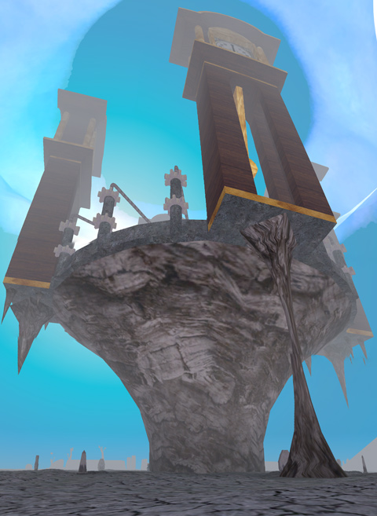
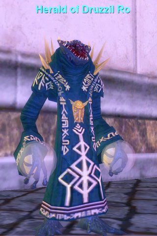
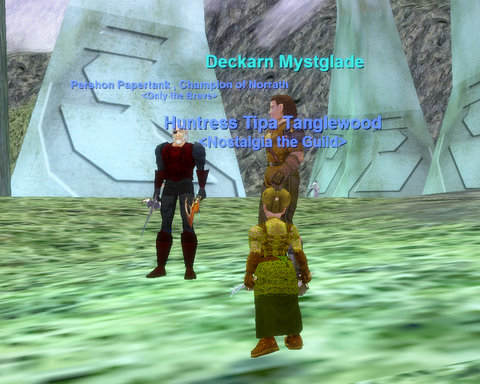
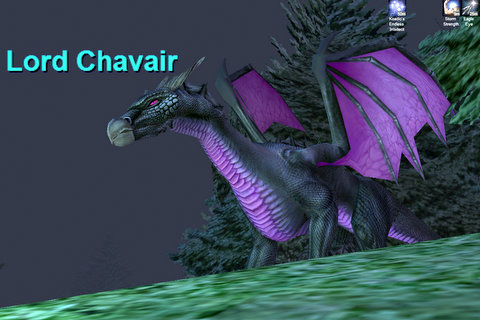
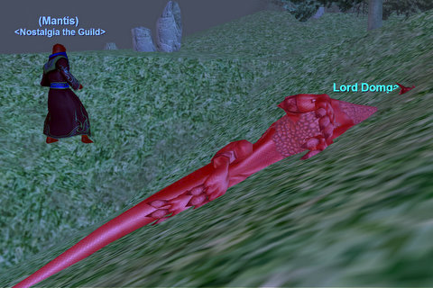
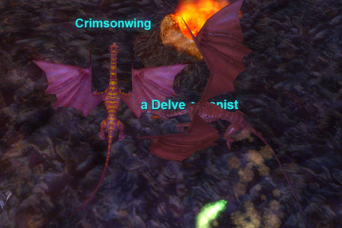

# EQ: Nostalgia enters the everlovin' PLANE of TIME.

*Posted by Tipa on 2008-10-04 00:26:03*

  
*Photoshop stitched together four screenshots to make this, automatically. Pretty neat!*

No, it's true. We went to the Plane of Time tonight.

Once upon a 'time' (sorry), that meant you had completed all the raids in Planes of Power -- lessee if I can remember them -- Terris Thule & Saryrn, Grummus & Carprin & Bertoxxulous, the Manaetic Behemoth, any trial in the Plane of Justice (didn't have to kill Seventh Hammer, though), Aerin'Dar & three Halls of Honor trials & Mithaniel Marr & Agnarr, Vallon Zek & Tallon Zek & Rallos Zek the Warlord, Solusek Ro, that alligator in Plane of Earth, and then the Elemental gods -- Fennin Ro, Coirnav (entire raid -- 14 minutes or you fail for three days), The Rathe Council (12 raid mobs -- six mezzable, six not -- need to die within 8 minutes of each other, IIRC), and Xegony (google 'xegony boobie taunt'). After doing all that -- and how many times for each raid before all of 72+ people were flagged? -- you could zone in to the Plane of Time.

 Now it's about as hard as walking into a wall. Just hail this bozo and say "Got the time?" and *poof*, there you are. He'll also send you if you say, "please make a year of determined effort instantly pointless". Nah, kidding about that one. Maybe.

Honest truth is, I would so love to raid Plane of Time, one last time. In fact. I would run every one of the raids leading up to the Plane of Time again. Because they were SO. MUCH. FUN. If you were in a raiding guild, it was never better before and never got better after than it was in the Planes of Power. After PoP, *NO* MMO dared to ship their game without a full set of raids because how else could they EVER hope to compete with EVERQUEST?

That's died down some lately. But how many games tried to copy the master? WoW for sure, but they flinched, made their max raid size 40, and then 25, and now 10. Devs give a nervous little laugh at the thought of MEGA RAIDS that required 72 people to accomplish -- that needed raid leaders and sub leaders and team leaders and so on.

Anyway. So, Plane of Time. Big whoop :) Not like we could ever raid it.

The latest patch notes told of a mysterious wanderer last seen in the Dreadlands who seemed awfully concerned that the veil between the present and the past was being rent asunder by some dreadful force.

He sends people to check on reported disturbances in the Field of Bone, Warslick Woods, Commonlands, Qeynos Hills and the Rathe Mountains. So I'm thinking, Kaesora, Dalnir's, Befallen, Blackburrow and ... but that doesn't work, there is no dungeon in the Rathe Mountains, unless they added one I don't know about. Best check this out. I thought maybe I'd get an update just for zoning in, but no such luck.

Field of Bone was infested by dragons. These dragons were in a state of high dudgeon. They'd just be in a horrible fight over the Field of Bone against the Iksar emperor Ganak, and things were not going well. Next thing they know, they're here, Jared'Dar's bones are picked clean in the center of a mysteriously appeared crater, the entire area seems to have not seen war for centuries... it's very confusing. One poor dragon was not only pulled through time, but universes as well -- ripped right from World of Warcraft.

|  |  |
| --- | --- |
|
 *Mmm, yummy troll dinner snack!* |
 *Whaaa? Where'd that troll go? And why are my colors kinda dull? Mother?* |

With Warslick Woods being so near, I zoned over, had a quick look-see for Grachnist the Destroyer (nope, Mr. Shrunken Goblin Earring once again being a no-show), and then tracked a couple of bright red dragons in the area. I wondered how they were doing. Really. My only concern was for their health. As in, their percentage of health. As in, steadily declining toward zero.

This guy was doing fine, if somewhat bewildered. Cousin to Vishimitar, if I know my dragons. The color, anyway.

Now this guy grew tired, and more tired as I watched. In fact, I took out my bow, hit my Trueshot Discipline, and helped him become tired even more quickly as the bard kiting him did his thing. Bard had a gnome mask -- those are RARE. Anyway, when he saw the adds that were following him die, and me plinking away, we grouped up, finished making the dragon very tired, and I got a quest update when it finally lay down for a good nap.

The bard grabbed the loot and logged. I felt happy to have helped out.

By that time we had a fairly full group of people online, so we headed off to Lavaspinner's Lair once again to try out luck there. Three people needed drakes and two needed spiders; just because I wasn't paying attention, we went to the drakes first. Seja and I finished our drake collection quests, Mantis made some progress, Coldheat hit 60, everyone else made between 2-3 AAs, it was all good.

There was a raid mob on track, and we kinda were heading toward it when sanity prevailed. We turned back and pulled another, easier named, killed that no trouble, then were ambushed by Crimsonwing once again. Crimsonwing took her death well, except near the end where she gated away and summoned people, one-by-one, to die far from the group and surrounded by adds.

I have to admit I'm not feeling the love for Crimsonwing that I probably should.

Since we aren't getting enough people on to raid, we're likely going to be leveling up again soon. If we're just going to be doing group things, might as well get to level 65 so we can go to the Bastion of Thunder and just have a good time with the grouping. BoT is all sorts of fun. Good challenge, good xp, good loot, a LOT of different places to go. Looking forward to it.

