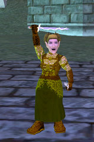

# EQ: Do you PLAY EverQuest and also BLOG about it?

*Posted by Tipa on 2008-10-04 09:26:23*

 If I type "EverQuest Blog" into Google, I get pages and pages of plat seller spam, sites like Ten Ton Hammer and Warcry reblogging SOE press releases and stuff. But one thing I don't find are actual blogs about people who are playing EverQuest.

I don't even find THIS blog on such a list. It's bizarre and backwards to me that I can't find anyone -- including ME -- blogging about actually playing the game. I know it's old, but I see bunches of people in game all the time, so I know there must be SOME people blogging about it.

Sure, EQ discussion has traditionally been on the community message boards and on the SOE forums and, of course, on guild message boards (which are usually closed to the general public). So there's undoubtedly a lot of talk about EQ that just doesn't appear on Google. Message boards are notorious for not being friendly to Google.

Anyway. There's always the chance that you're an EverQuest blogger or read other EQ blogs if you're reading this one. So... what's the URL? Because I'd REALLY would like to read about the adventures of other people in the game that really did more than any other to shape the MMOs that followed it.

