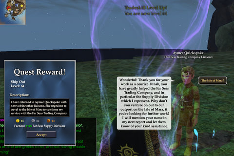
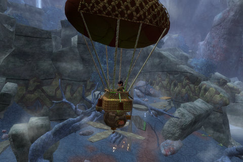

# EQ2: Crafting an alliance

*Posted by Tipa on 2008-11-21 09:39:36*

No, really, I'm sure there are millions of puns out there about "crafting" and "tradeskills". No laws against them. They aren't WEA-PUNS of LAUGHS INSTRUCTION, after all.

So, yeah.

Still shocked and awed by the coolness of the Shadow Odyssey crafting quests. No killing. NO FRIGGIN KILLING. I had a quest to rebuild a cannon for some quick ballistic travel between a couple of areas, and after gathering ore, it asked me for a wire from a sweeper bot. "Okay," thought I, "finally some killing!"

So I stealthed all up, got in position, targeted the sweeper bot, and the quest text said I yanked a wire from it and the quest updated. Didn't have to kill it.

This is the first expansion where you really, truly, honest-to-God don't have to kill stuff if you're a crafter. Spent more time in front of the loom than behind a shield? NO PROBLEM. TSO's got ya covered. These quests aren't gonna ask you to do something you don't want to do.

Lessee.... let's count up the number of other popular MMOs that decouple adventuring and crafting levels. Um. Vanguard? LotRO? (I think they aren't coupled in LotRO but don't remember for sure). One of the things that really bugged me about WoW crafting was having to level my alt in adventuring in order to train up some other tradeskills.

Anyway, even though I had to drive all over New England to bring my son back from college for Thanksgiving (well, I didn't mind), nothing was going to stop me from finishing the Moors of Ykesha crafting quest line in order to get enough faction to do crafting missions with my guild, who were totally wonderful about holding off on trying one until I'd finished the quests. They are so totally awesome.

Dinged 141 AAs from discovery xp and level 64 tailoring from tradeskill xp (yeah, all the quests give tradeskill xp as a reward. How cool is that?). I had to make things from several different crafting disciplines. All the recipes were 70, and yellow to me, but I didn't have any trouble with them. Bard Power Song gives me the freedom to use the really expensive crafting arts with wild abandon, so even doing things WAY outside my comfort zone, like wood working, was no problem.

Should be fun. We're planning to try a dungeon after our Nostalgia group in EQ tonight.

