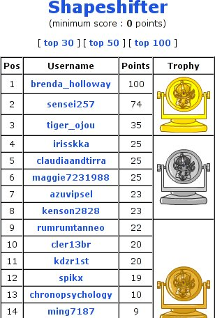

Back to: [West Karana](/posts/westkarana.md) > [2008](/posts/2008/westkarana.md) > [April](./westkarana.md)
# Shapeshifter CHAMPION!

*Posted by Tipa on 2008-04-01 08:08:47*

Some of you might remember a little bit of [Neopets](http://www.neopets.com/) mania last summer. There was [this one puzzle](http://www.neopets.com/medieval/shapeshifter.phtml) that just seemed so hard, that I had to write a program to solve it. [It took over my life for months](http://shewhoshapes.wordpress.com/). I finally gave up trying to solve it entirely. In February, I took it up again, and given some algorithmic help by a past champion, finally beat Shapeshifter.

It's all very Karate-kid-ish.

I only played Neopets to solve this one puzzle, and now that it's done, I won't ever play again. I'll put my Neopets up for adoption. But for the entire month of April, my name will live at the top of the high scores, and if I die tonight, I'll die knowing that I died a bona fide champion.

This wasn't the final puzzle, but it was close. Surprisingly, this is one of the easier puzzles.

