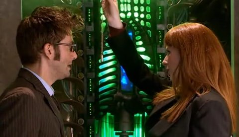
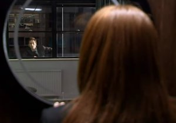

# Doctor Who: Partners in Crime

*Posted by Tipa on 2008-04-06 11:26:22*

Last night, millions of Britons (8.4 millions to be exact) sat down to the first episode of the latest series of Doctor Who, the first with Catherine Tate (who co-starred in the 2006 Christmas special). And today, millions of people outside the UK downloaded it and watched it as well. I watched it on my television via my Vista laptop running the media center extensions for a show I'd downloaded on my Linux desktop computer. The wonders of a home network :) As I watched it from the couch with my morning waffles and Diet Coke, I thought how wonderful it will be when BBC makes some sort of deal with some US network so we can see it the SAME DAY.

I mean, it's the same thing going the other way. People around the world watch our Lost and Battlestar Galactica; I bet they'd love to see it same day as well. I faithfully watch Jericho, Lost, BSG and so on, on the television, as they are broadcast, with commercials, because I want to support these programs and see more like them. I would gladly do the same for Doctor Who if I could get it on Saturday evening like the do in London. So, speaking of London, on to the show.

I don't know much about the UK aside from what I learned in school -- the king, mad with lead poisoning, puts his onerous taxes on us until we elect George W. Bush who cuts them and then we declared independence and gave them Canada or something. I'm not sure on the specifics. Apparently they no longer even have a king! Maybe they lost him in a poker game with France? Battle of Hastings... William of Orange... I dunno, I'm an American. Reformation. Are they still doing that? But I'm pretty sure that Cardiff must be the Vancouver of England, though. A nice city in another country which you can claim is New York, Los Angeles, or London.

Anyway, past here is all spoilers. So if you want the episode to be deliciously unspoiled, stop here. Otherwise, click on through.

Adipose Industries has been selling miracle diet pills -- "the fat just walks away" -- for weeks to a million Greater Londoners. Now they want to go nationwide. Apparently, when they say the fat just walks away, they mean it. At approximately ten past one in the morning, a kilo of fat pops off your body as a little chubby doll and scampers off. So that's weird. Seems some aliens are using Britain as a breeding ground for their young. Because. Britons. Are. So. Fat.

IN YOUR FACE, ENGLAND. YEARS of making fun of us Americans for being fat, but when the aliens come for the truly rotund, they skip RIGHT OVER US and head STRAIGHT TO WALES LONDON.

Anyway, since Catherine Tate's Donna decided not to hang out with the Doctor after her adventure with him a year and a half ago, her life has taken a turn for the dull. Nagging mother. Doesn't even have her own car. Her granddad is a kook who spends the nights gazing at Venus (the only planet named for a woman, he tells Donna). (What he doesn't go on to say is that Venus is an acidic, vitriolic planet with a dead landscape that you can't live with. And it's good he didn't, because I'd have been ALL OVER him. I think he implied it, though, so I'm still kinda heated).

 So she decides to go looking for the Doctor. She piles all her luggage in her mom's car and goes looking for trouble, sure he'll be there, too. She finds trouble, and after fifteen minutes of near misses, finds the Doctor as well, as they look in through opposite windows as the villain is explaining her master plan to a hapless bystander in true villain fashion. Donna tries to explain what she's DOING there. This goes on for awhile until the villain excuses herself, but hopes she is not interrupting anything.

Well, it's all chases, sonic pens and screwdrivers, and alien spaceships from then on. Once again, London is assaulted by aliens. But of course, it's all a hoax, because that's what they read on the Internet.

In the end, though, when Donna starts to move her luggage into the TARDIS, the Doctor says no, she can't come, even though maybe he offered. He broke Martha's heart when he didn't mean to; he lost his true love, Rose, to another dimension; he broke Sarah Jane's heart many years ago as well. All he's looking for in a companion now is a mate.

"You want a MATE? You want to MATE with me?"

"Nononononnono!!11!!! I just want A MATE. A --- MATE."

Don't they have the word "friend" in Britain? Buddy? Pal? I guess that's why Gandalf was so confused outside the gates of Moria. If the dwarfs had written, "Speak, Mate, and enter" -- they'd have sailed right in. "Friend"? I guess you can't be *friendly* in England. It's all "oh, he acted all mately, but I knew he wasn't a real mate. Mateship isn't something you give lightly!"

 Anyway, after explaining wistfully to her granddad that she'd found the man of her dreams and let him "fly away -- in a blue box", she assures the Doctor that she has no interest in his skinny butt, and off they go -- to buzz her granddad and head off to Pompeii. Pompeii, hundreds of years old, but guess when they arrive? Yup. Volcano day. Don't they always?

Donna leaves the keys to her mum's car in a trash bin near the scene of an awful accident -- seems a woman fell off a spaceship, horrible tragedy, all too common these days -- and tells a blonde woman to tell her mum "THAT bin THERE" if she should come by. Donna doesn't know her, but we do. It's Rose. She turns and fades away.

