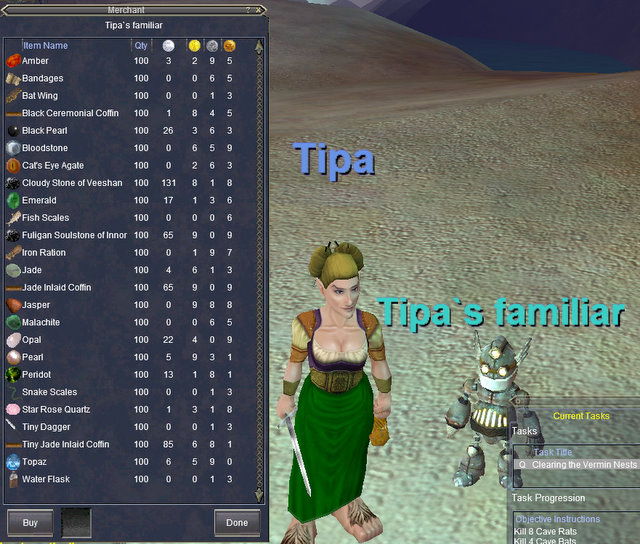

Back to: [West Karana](/posts/westkarana.md) > [2008](/posts/2008/westkarana.md) > [April](./westkarana.md)
# EQ Year 10 Veteran Reward

*Posted by Tipa on 2008-04-18 07:48:02*

Tonight is the first meeting of our EQ Nostalgia group, and I've been swamped with work to do. I had to [create some forums](http://nostalgia.chasingdings.com/), try to pull a roster together, try to make this a fun experience for our little group. I think I'm ready for tonight.

One advantage EQ vets have over people entirely new to the game is the huge variety of veteran rewards -- from double xp to full xp rezzes (once a week) to buff pets that follow you around; there's a lot of good stuff here. Along with that come all the /claim items for the expansions. I never used any of them except the horse barding, but they include damage auras, bags (I claimed one!), faction items, mounts (there's a robo-boar and a warg in there)... cool stuff.

Right now, I'm a level 2 ranger waiting in the Gloomingdeep Mines for 7PM to roll around. I made a Drakkin wizard alt last night and took her partially through the tutorial. Although the first couple of quests are easy, a group will make the last few far faster. I worry, though, that our experience will be nerfed too much because of being grouped... but, hopefully, we'll be able to kill so much more stuff, so much faster, to make up for it.

The just-added tenth year veteran reward is a little clockwork merchant that very much reminds me of the WoW repair bot that also sold useful items. Here's me, my bot, and the stuff he sells:

If you're in the Nostalgia group, register for and [READ THE BOARDS](http://nostalgia.chasingdings.com)!!! And see you tonight :)

