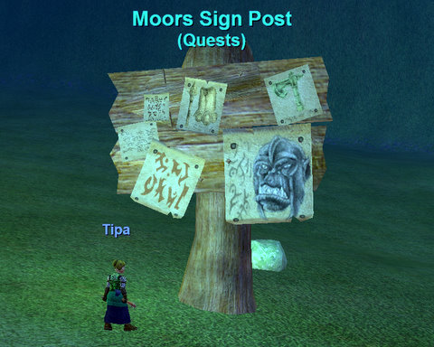
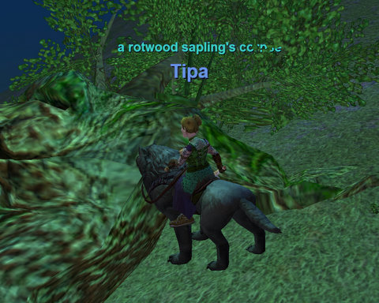
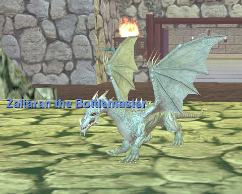
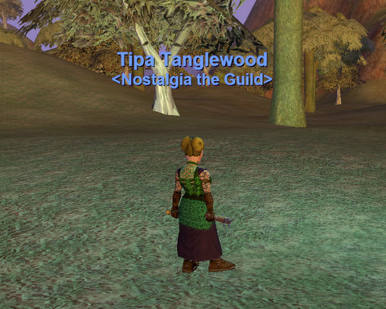

Back to: [West Karana](/posts/westkarana.md) > [2008](/posts/2008/westkarana.md) > [April](./westkarana.md)
# An evening in the Moors

*Posted by Tipa on 2008-04-27 14:13:56*

People who think it is hard to level in EverQuest haven't even been through Blightfire Moors. This 20-30 zone will level you so fast, and leave you with such great gear, that you'll hardly notice you skipped past most old-world content. That's been a problem with the progression guild. Every week, we find ourselves smashed against our weekly progression limit because EQ leveling is now so fast. Back nine years ago, you had plenty of time to smell the roses. Now, it's a mad rush, and I have no idea where the express train ends. We're going to have to take a step off it so we can see some of the old places we loved.

I spent some time doing the level 20 Crescent Reach armor quests that go through the Moors. Crescent Reach has a number of fantastic quests that pull you through the place. This sign post gives a number of quests which largely involve running around or killing local mobs for fairly common drops.

It's sad when good trees go bad. I'm sitting on the the worg mount that came with the Secrets of Faydwer box. Who needs Spirit of the Wolf when you have an ACTUAL wolf?

Highhold Pass connects Blightfire Moors with Kithicor Forest and East Karana. I met a cute little dragon inside Highhold Keep as I passed through. Turns out he was a tricksy GM there to give me my surname and my guild! He also gave me a stack of brandy, but I had drunk it all before he could warn me not to drink it all :) I was sooooo drunk.... You can see the sad results on Halflings Gone Wild IV.

Mmmmm.... finally have a guild AND a name! And life was good!

