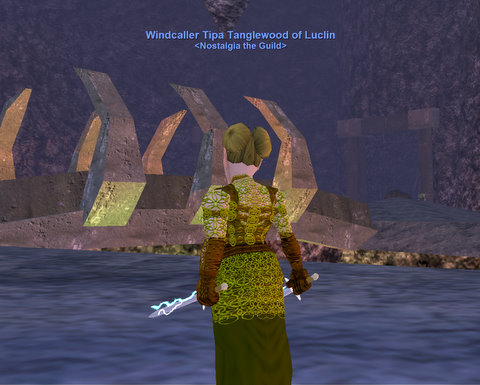

Back to: [West Karana](/posts/westkarana.md) > [2008](/posts/2008/westkarana.md) > [August](./westkarana.md)
# Training skills in EverQuest

*Posted by Tipa on 2008-08-06 07:46:34*

The clock on the cable box in the living room is twenty minutes slow; I *know* I shouldn't rely upon it. I was trying to be clever and use my Asus Eee from the living room to SSH into my Linux box and copy the latest episode of The Middleman to my Vista laptop so that my PS3 could find it and play it. I have this crazy idea that I can use the Eee to control every piece of electronics in the house. I'd managed all that, when I noticed the Eee had a different time from the cable box -- the correct time -- and that I was late for the Tuesday Nostalgia group.

I ran to my room, jumped online, but nobody else from the group was there. I checked the boards and it looked like a lot of people weren't going to make it; Hakiko may have been there and left already, I don't know and nobody on had seen him. So I went to the Bazaar and thought about buying some gear to fill up all the empty slots in Sela's armor, but after about an hour, decided to work on Tipa's levels and AAs instead.

Since we raised the level cap from 52 immediately after killing the dragons last week, most everyone has been madly leveling ... the three levels to the new cap of 55. Some people have wished for the cap to be 60 instead, but I want Nostalgia the Guild to be the kind of place you can come once a week and not fall behind. With AAs, there's always something to do for those who want to play more.

I made level 53 the same night we removed the cap in the Crypt of Nadox, the level 55 hot zone. I made 54 in Akheva Ruins while we tried to do with one mid fifties group what raid guilds used to do with four level 60 groups -- take on Va'Dyn, the giant rock monster who is one of Luclin's first raid targets. We eventually managed to get him solo, but we could not take his damage. Still, made a level from the attempt because AR is, too, a hot zone.

Last night it was back to Nadox where I got 40% of the way through level 55 and my 20th AA, which I spent on Weapon Affinity. There are SO MANY AAs after so many expansions that it's tough to figure out which to get. I have Run Speed 3, Innate Regeneration 3, Foraging (by mistake), Combat Fury 2 and Weapon Affinity 1. The last couple will increase my dps a lot.

The group I was in couldn't keep mobs off me, even if I did nothing but auto-attack (I've a variety of nukes and dots I can add, including uber nuke Icewind that I quested for last weekend). I kept casting jolt, but finally decided nothing would work but to stay out of the fight entirely for the first few seconds. That helped some. Chain casting Jolt worked somewhat but was harsh on my mana.

The night was marred by the constant stream of high level monks who would go from camp to camp in Nadox looking for nameds to steal, bringing trains with them wherever they went, leaving death behind them. Sure, they could have feigned their trains off, but there was always the possibility that some level appropriate groups might get the nameds in their areas before they did. And there were plenty of level appropriate groups around. The fifties are the time you start coming upon the majority of the players. Most of the group was probably alts, but their twinkage was usually not high; I was the only one wielding epics, anyway.

So when I say training skills, I'm talking about the monks' skills at training. I can't tar them all with the same brush -- we had two monks in the group who seemed very capable -- but it certainly seems that if you want to be a real jerk, and you really care nothing about anyone besides yourself, a monk is the way to go. Once all the lowbies in the area are dead or dealing with your train, you can steal their named mobs.

Years ago, being trained would have really bugged me, because I cared about leveling and loot. Now that I realize neither of those things matter, I just take these things as they come. Being able to affect someone else's game play, for good or ill, is just part of EQ. I got trained, and I died, but I got dragged to a friendly cleric, got a rez, full buffs, and an invitation to join their group. Being trained was bad, but I got to meet new, friendly, good people as well. In an entirely instanced game, neither would have happened. World of Warcraft, et al, by taking away the bad parts of open dungeons, took away the good parts as well.

