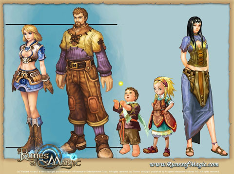

# Runes of Magic coming soon to a Leipzig near you!

*Posted by Tipa on 2008-08-08 22:54:03*

Much anticipated Asian/European WoW-like [Runes of Magic](http://www.runesofmagic.com/en/index.html) starts its closed beta August 28th. Even though no North American publisher is yet announced, they vow to have English servers for those who prefer that language, and they don't care where you're from. It's all free, after all. They'll also have French and German servers for the Gallicly and Teutonically inclined.

They will also be showing the game at the annual [Games Convention](http://www.gc-germany.com/index.php?lang=2) in Leipzig, along with lots of other games [we may never see here](http://tcos.com/sbforum/viewtopic.php?t=14239). Leipzig is pronounced "LIPE-zig". [I checked](http://www.forvo.com/word/leipzig/), this time.

Seriously? I'll give Runes of Magic a try. Why not? Always on the lookout for good free-to-plays.

