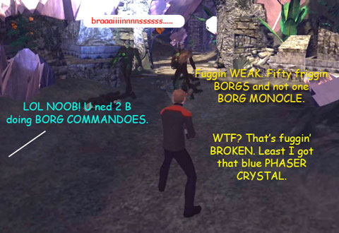

Back to: [West Karana](/posts/westkarana.md) > [2008](/posts/2008/westkarana.md) > [August](./westkarana.md)
# STO: To go boldy...

*Posted by Tipa on 2008-08-11 06:40:11*

Thanks to TheRemedy for the heads-up on the [Cryptic Star Trek Online trailer](http://www.gametrailers.com/player/38183.html). The trailer jumps from fight scene to fight scene, and the game seems to go boldly where all the single player games have gone before. Some of these fights look straight out of Star Trek Armada 2, and the hand-to-hand fights look just as pointless as fights in every other MMO. I did some poking around the Cryptic web site and found a list of quest descriptions. I'm interested to hear about more STO quests if you know of any :)

QUEST #: 137
QUEST NAME: Mirror Academy
LOCATION: Starfleet Academy
OBJECTIVES: Kill [15] [Mirror Universe Cadets]
TEXT: Ah, [Player]. An engineering student coupled the phase-inhibiting core bayronic-matter enhancer with the prime cycle correlator and created a rift in space time and now the cadet mess hall is hopping with Starfleet cadets from the mirror universe. Kill [N] of them and return to me for your reward.

QUEST #: 2048
QUEST NAME: It is a good day to die...t
LOCATION: Ice moon of Alpha 3
OBJECTIVES: Harvest [50] [Alpha 3 Ice Snowballs]
TEXT: We are sorry to interrupt your training exercises, but the Balfoozian delegation will be here in two Earth days, and we're all out of their favorite kind of ice cream. Please take a shuttle from the shuttle bay and harvest [N] [Item] from the Ice Moon of Alpha 3. Good luck, and watch out for the Alphanian Rabbits!

QUEST #: 16184
QUEST NAME: Don't be Kahless with that!
LOCATION: Klingon Home World
Objectives: Raid
TEXT: [Player], you will have a long and glorious career here in Starfleet. But this is no time to rest upon your laurels. We have word that the evil Klingons are attempting to bring to life a fallen leader to lead them into battle against the Federation. Gather your classmates and take shuttle Copernicus to the Klingon home world. There, you will break in to the Imperial Palace, kill 100 Councilmen and 20 High Councilmen. Make your way into the inner sanctum, and kill the Warlord and the Emperor before they can use a chronosynclastic biofeedback loop to resurrect Kahless. This will be your hardest assignment. And I must impress upon you -- if Kahless is brought to life, it could mean the end of the Federation, Starfleet, and your career. See that dead heroes stay dead. Your final grade depends upon it.

