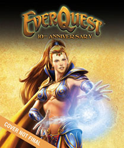

Back to: [West Karana](/posts/westkarana.md) > [2008](/posts/2008/westkarana.md) > [August](./westkarana.md)
# EverQuest's 10th Anniversary Book

*Posted by Tipa on 2008-08-14 08:14:40*

Remember those spam books that you could get in the 80s that would claim to have all the genealogy of your family name and trace your roots and print your family crest and stuff? And then it would turn out to have the phone book information of everyone in the country with your last name, along with some really generic information and a totally made up crest.

I'm not saying [EQ's 10th anniversary book will be anything like that](http://www.bradygames.com/promotions/promotion.asp?promo=136637). The description of the book just reminded me of it. Here's what it includes:

 * The original storylines for EverQuest and EverQuest II.

 * Interviews with key contributors to the EverQuest legacy, including John Smedley, Russell Shanks, Brad McQuaid and many others.

 * See the world of Norrath come to life! Concept art to final 3D art representations of famous EverQuest and EverQuest II locations, as well as descriptions and commentary from the development and community teams.

 * Concept and promotional images of famous NPCs, with interview notes from the developers about why and how they were created.

 * Wireframe model shots, rendered shots and previously unreleased artwork.

So, screen shots and copy/paste from old interviews.

I'd love to see a round-table discussion with the original EQ devs where they talk together about making the game, share stories, whose baby was born in crunch time, you know, the cool stuff. Or some of those old long flamewars that would follow Abashi whenever he posted on the EQ forums about ANYTHING, that led SOE to closing the EQ forums entirely because every new player that tried to ask any question at all would be mercilessly flamed.

EQ, to me, is so much more than its concept art. It was a game whose success depended almost entirely upon its community. To have a book that only talks to the devs misses an opportunity to make a truly memorable EQ memories book.

I'd like to read about the adventures of the first people to kill Nagafen and Vox. About the "duel wars" when the results of a duel would be broadcast through the world and people would make fake alts just so "Cokeclassic has defeated Pepsicola! Pepsicola has fled like a cowardly dog!", though usually they were not that generic. Reports of the Battle of Bloody Kithicor from the troops. The list of steps you would need to do, in order, to gain access to the Plane of Time. [The banning of Ewle](http://eq2flames.com/your-guild-sucks/818-ebonlore.html) and Ebonlore. The sad tale of [the people who first woke the Sleeper](http://www.mmorchive.net/2008/03/20/ban-galore/#more-74). Or when the pranksters of Tarsis Shriners [went to Kedge Keep and shouted EVAC!](http://www.gweep.com/posts/evac.htm) in the zone and half the groups in the raid that was killing Phinny suddenly poofed. Or the weekly "uberscore" list tracking raid guild kills that evolved into a community discussion thread. Or when soon to be ex-Guide Tweety (and soon after to be DAoC community manager) posted her infamous "[Nutless Assmuncher](http://eatingbees.brokentoys.org/the-wayback-machine/try-being-a-guide-you/)" post.

There are so, so many stories in EQ, and very few of them were told by the devs. A book collecting the stories of the PLAYERS would be an instant classic and sell millions. A hardback book of concept art and tired interviews... I dunno. Heck, I bought the instantly outdated EQ Atlas when it came out, I have it around somewhere. I'll probably buy this as well. But it could be so much more and with this book, we'll never get the book that tells the story of the REAL EverQuest as it was loved by millions. Well, a million.

