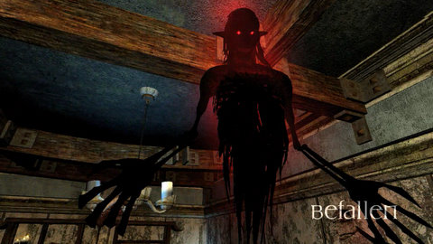
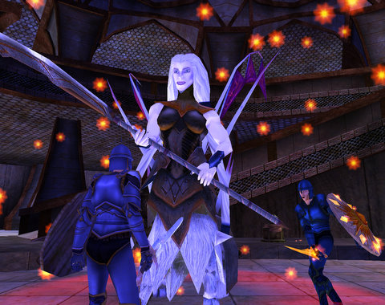

Back to: [West Karana](/posts/westkarana.md) > [2008](/posts/2008/westkarana.md) > [August](./westkarana.md)
# First expansion reactions

*Posted by Tipa on 2008-08-16 11:40:46*

I'll be seeing these live hopefully later today, but here's my first reactions to the expansions.

EQ2: The Shadow Odyssey

So, we're getting Lost Dungeons of Norrath, EQ2 style. I don't know if this means the return of the Wayfarers, but I kind of hope it doesn't, as the Wayfarer's led into the ugly Gates of Discord and Omens of War expansions, which kinda broke the whole fantasy feel of EQ with their SciFi aliens from across the 8th dimension, a mistake finally corrected with Dragons of Norrath.

Anyway, expect a single gorup focus, the reurn of Innothule Swamp and its signature dungeon, Guk.

Also returning is the dungeon of Befallen, which is a little odd, since we all kinda thought Stormhold was Befallen, given the NPCs like Gynok Moltar who spawn there, the heritage quests like the Bone Bladed Claymore that go through there, etc. and now, here's Befallen. 

It won't really feel like Befallen unless you can fall into a deep hole, die, lose all your stuff and have to start over.

Ah, Befallen memories.

Remember how much people hated that whole aliens from across the 8th dimension thing in GoD and OoW? Well, they're BACK.

They are adding Guild wars-style hirelings in case you need someone for your group. This can work out one of two ways. Either the hirelings are awesome, removing the need to find a real human for their spot and removing the need for clerics outside of raids entirely; or they are weaker than players and useless. Guild Wars does it th first way. I expect EQ will be going with the second/ Shrouded characters are far weaker than the equivalent player; I expect the same for hirelings.

But, if you could have a full group of competent hirelings to help you, then perhaps new players would be able to level up to their fifties, where grouping begins, without having to two box or get powerleveled.

Anyway, time to get ready for a fun day :)

