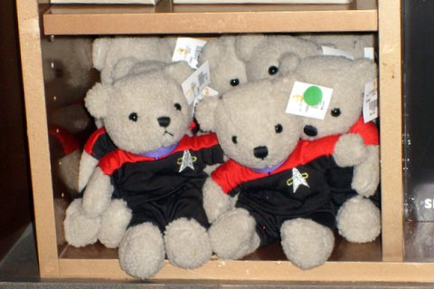

# More on the Fan Faire

*Posted by Tipa on 2008-08-16 16:48:21*

On the way to the EQ2 expansion panel, stopped by the room to upload some pics.

Attended the Living Legacy feedback panel, more notes later, but it sounds like it or something like it will be coming in the future, perhaps as soon as the tenth anniversary celebration next spring. A new progression server is a possibility (for EQ).

Talked with a guy from Matrox for awhile, angered some VG players, and ate lunch at Quarks.More later!

Oh yes, Kirk-bear and Picard-bear are now mine.

