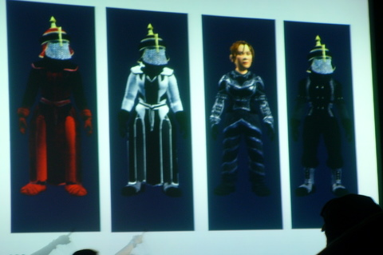

Back to: [West Karana](/posts/westkarana.md) > [2008](/posts/2008/westkarana.md) > [August](./westkarana.md)
# EQ2: New clothes for old tailors

*Posted by Tipa on 2008-08-16 20:51:49*

Just a taste of the new low level crafted outfits. They add bunches of colors for all tiers, and some real choices for leather and cloth wearers --- up there are some of the choices, including some vest styles for even more options. You won't have to be look boring if you're a caster.

Lots, lots more!

## Comments!
---
**stargrace** writes: *wipes drool from... everywhere..*
---
**almagill** writes: Hurrah for more choice!\r\n\r\n(Is it just me or do those look like they are wearing <a href="http://www.glosk.com/US/Liberty%20Monument/10549869/photos/Pickelhaub/24452_en.htm" rel="nofollow">pickelhaub</a> (even though I know they're not. Probably)?
---
**Ogrebears** writes: Though look pretty cool.  I wish i had gone to fan faire.
---
**Tipa** writes: I wish I had made more preparations to meet up with people. The only person I met there was one of my leads at Massively, Krystalle. But then, most everyone got there Thursday and a lot of stuff happened Friday, but I didn't show until Saturday. Next time, if there is a next time, I will make sure to arrange to go for the entire thing.
---
**Isanox** writes: Speaking of crafting and Fan Faire...\r\n\r\nI heard something about an epic dungeon for crafters in the next expansion.\r\n\r\nDo you have any more info on that?\r\n\r\nThanks in advance
---
**Tipa** writes: Yes, there are three crafter missions, for up to a full group of CRAFTERS. Not a killing mission, these are CRAFTING missions and are the very first ones in any game EVER. I wrote about them <a href="http://www.massively.com/2008/08/19/what-you-need-to-know-about-the-shadow-odyssey/" rel="nofollow">in an article for Massively</a>.
---
**Gnewton** writes: GREAT write-up Tipa!!!  Oh, and HELLOS!!!!!\r\n\r\nVery interesting read.  I just sent it to my sister-in-law and my future brother-in-law (both of whom helped start our guild on Kithicor)... Gotta dangle the carrot in front of them so they'll come back to play :)\r\n\r\nAnyway, just wanted to poke my head in and say GREAT WORK and I miss you guys :(
---
**Tipa** writes: We miss you terribly as well, Gnewt! We haven't had any gnomish love since you left.
