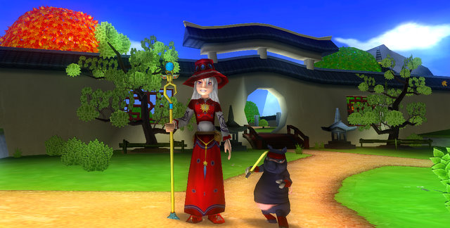
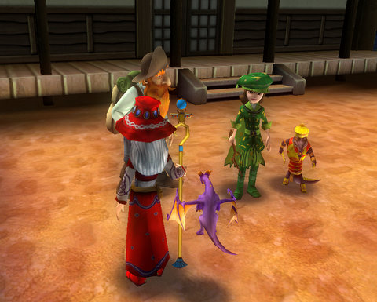
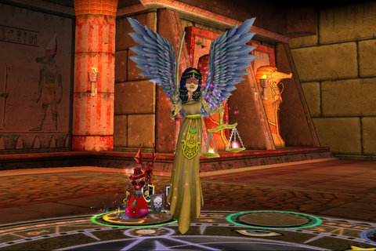

Back to: [West Karana](/posts/westkarana.md) > [2008](/posts/2008/westkarana.md) > [August](./westkarana.md)
# Wizard101's subscription plan and item shop

*Posted by Tipa on 2008-08-28 07:00:31*

  
*Judgement Robes and Ninja Pigs in the world of Moo Shu*

Well, I was intrigued enough by the chance to test out Wizard101's item shop that I snuck back into game today to have a look at what Prospector Zeke was selling.

There's a Prospector Zeke in every world; he usually gives out the collection quest they have in each world, where you have to find very small things in every zone of a world. Dwarven Smiths in Wizard City, Scarab Beetles in Krokotopia and so on. For this last bit of beta, he also sells items of great power. The Zeke in the Olde Town district of Wizard City even sells a pet dragon.

  
*The Zeke in Moo Shu, and friend*

You buy these special items -- which are well above the power of the usual items you'd find -- with KingsIsle Crowns, which apparently you will be able to either buy, get as part of a subscription, or both.

This [interview over at Yahoo says](http://videogames.yahoo.com/news-1236380-2):

> **Jonric: Since you'll have a cash shop, how will items sold there differ from the ones we can obtain through play?**

Todd Coleman: We intend to offer a pretty big array of items in our catalogue, but we have to be careful that we don't undermine the balance of the game, shortcut the advancement curve too much, or make it unfair to other players. We haven't announced specific details yet, but those should be coming soon. 

A game that charges a subscription fee AND has an item shop? Isn't that -- double dipping?

They do have interesting things planned for after release... like... pet olympics? [From an interview with MMOSite](http://news.mmosite.com/content/2008-08-10/20080810184854224,2.shtml):

> **MMOsite: What else can the players do aside from monster killing and pvp? How important a role do crafting and player economy play?**

Todd Coleman: Most of our focus so far has been on adventuring and advancement. We do intend to add a host of secondary activities post launch, like Off-Campus Housing, Crafting and Pet Olympics... but to get us started, we spent all of our development effort really polishing the core game: exploration, adventuring, questing and dueling.

Anyway, I have not been able to really pin down their plans. I don't think they have actually *announced* anything publicly -- definitely not on their website, and the interviews don't seem to cover payment plans.

Best guess still is a free to play portion, an item shop, and an optional subscription plan. Basically, every business model, all at once. Is that weird?

  
*Judgment, one of the creatures item shop garb can get you. 125 damage per pip.*

Anyway, we'll probably hear more very soon. But for the sake of their target 'tween' audience, they'd better include some sort of free-to-play option, and it looks like they will.

