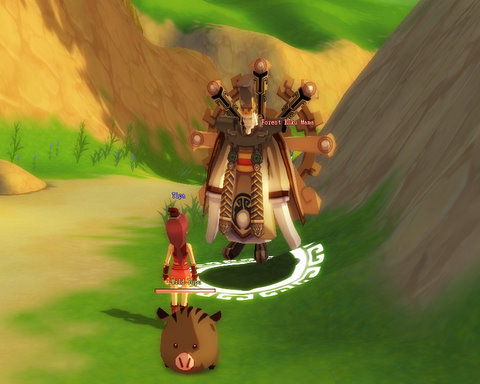
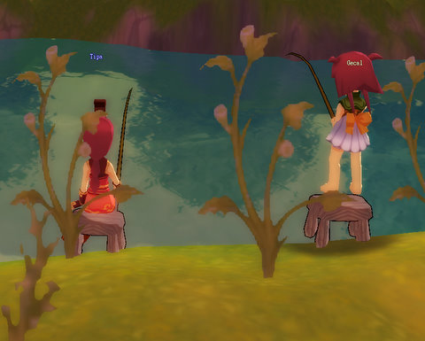
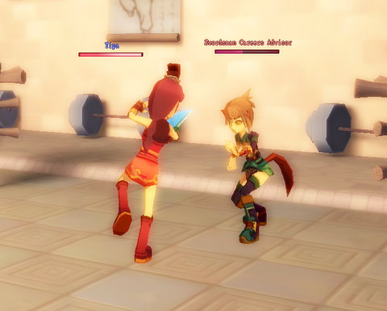
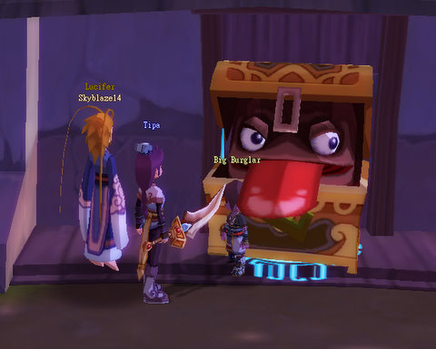
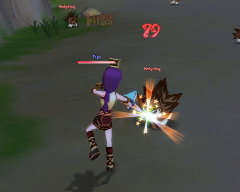
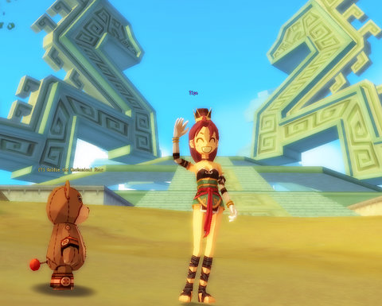

Back to: [West Karana](/posts/westkarana.md) > [2008](/posts/2008/westkarana.md) > [December](./westkarana.md)
# Dream of Mirror Online: Starting Over

*Posted by Tipa on 2008-12-02 10:10:54*

With Wizard 101's Dragonspyre world still in the unforeseeable future (WHEN, KingsIsle?), and Chronicles of Spellborn also months away (and the German one that should be showing up in a few days almost certainly impossible to play from the US), I needed a casual game. EQ2 is still my main game (and hours spent yesterday in the Moors and Befallen prove that), but I just can't play one game... so I went back to an old favorite, Dream of Mirror Online.

  
*I hit level 10 as a Commoner, and a Mirror King popped in to tell me how to select my first Job.*

Dream of Mirror Online -- DOMO -- scratches the same casual game itch that W101 satisfies. It's a casual game, very different from most MMOs that is simple to play but becomes incredibly deep. Also, it's free to play -- and unlike W101, entirely free to play. Aeria Games runs by selling appearance items, pets and other goods through their item mall, so you don't have to spend a dime if you don't want to.

  
*You can spend hours fishing, herding, farming, mining, meditating etc. You'll **have** to if you plan on crafting.*

Similar to other Asian MMOs like Final Fantasy XI Online and Runes of Magic, you can choose both a job and a subjob, after unlocking them through special quests. From then on, you can mix and match them freely -- though having to level up each one individually can be kind of onerous. Everyone starts out with the Commoner job. Commoners are the harvesters and crafters of DOMO; their levels bring greater abilities to find raw materials and make useful items from them.

  
*The quest to unlock the Blademaster job is defeating the Blademaster trainer in combat. That a level 10 Commoner was able to do this doesn't speak well for the job...*

DOMO helpfully gives you coupons for full sets of gear appropriate to your first two jobs. After that, you're on your own, and will have to either make the gear yourself (you DID do the crafting quests, right?) or find a friendly Alchemist (crafter) to make the gear for you. Or stop by one of the numberless player shops that litter Eversun City and see what they have to sell.

I wanted to unlock the Thief job, but that's pretty involved, so I took Blademaster job so I would have the battle skills to get the job. I didn't need them, really, but the money from killing stuff and finishing quests came in handy while I was running around the world working on the Thief quest.

  
*Second to last step in the Thief quest -- unlocking the chest! Wait! THAT'S NO CHEST!*

Grouping is rarely necessary in DOMO, but groups are fun and easy and very similar to those in World of Warcraft (Yeah, I said it. Bring it on, spammers.) The kind of WoW groups where you group up and then everyone just goes wild killing stuff. When you have quests like kill 40 Pure White Pus, 40 Li'l Pus, 40 Dairy Pu Mamas and 40 Dairy Pu Dadas, seriously, you want to group. And then everyone puts their AEs together and BOOM.

Fur and Pu-meat EVERYWHERE.

Thieves, btw, are an AE class in DOMO. So much fun :)

  
*Stabby Stabsworth takes on a hedgehog. Rawr. Love the Thief job.*

The game runs on anything. At low settings, it looks like a Hanna Barbera-style cartoon. At high settings, it looks like a REALLY NICE cartoon, with cel shading, shadows, goofy expressions and cartoony action. Even at the highest settings, though, I have no trouble running it on my laptop. So that's a total win for me.

  
*Me and my friendly robot bear pet in front of some mysterious temple I happened across.*

When I returned to DOMO, having played it for a few hours last spring, I decided I was just going to set aside my concerns about the grind and the RMT-based business model. MMOs shouldn't be about how fast you level, they should NEVER be about that. The only question that an MMO needs to answer positively is, am I having fun when I play? 

I do have fun when I play. I don't worry about levels because -- who cares what level I am? Besides, leveling isn't THAT slow. There are repeatable quests everywhere that are simple and quick to do if leveling is your only concern. It's the thrill of learning entirely new game mechanics (I haven't even scratched the surface of the differences between DOMO and Western MMOs in game mechanics. Equipping different weapons to see which ones fly the best? Yup. Not even scratched the surface.). It's the joy of finding utterly strange places and not knowing what the heck to do or where you are (though the numerous DOMO fan sites will help you out). It's meeting all the people from Brazil and Portugal who think Tipa is a Portuguese name :P

Okay, that's a little weird. Still, the DOMO community is fantastic, and I don't understand why that is. Most F2P games are exactly the opposite. But everyone I grouped with was helpful and it was far more common for people to invite others into their groups to make the mass killing go faster than in games like WoW, where people begrudge forming parties with people they don't know.

The game designers, by the way, must have been insane. There had to have been competitions among the devs over who could think of weird things to put in the game. I haven't even mentioned the *plot* that runs through the game, complete with cut scenes and mini adventures. Or the romance features (love someone? make it official and you get healing powers and other abilities). You can set relationships with other people (like rivals, friends, teachers, etc) that give you additional abilities with them. Your weapons evolve as you use them, too... in fact I evolved my thief's dagger so much that I can't use it any more (my mistake, and I was warned and went and did it anyway), so I'm back to Blademaster while I save enough money for another... or maybe I'll just use my thiefly Pilfer ability and see if I can snatch the recipe for one from some rats in the Eversun Inn, and then use Alchemy to craft a new one... Hmmm....

