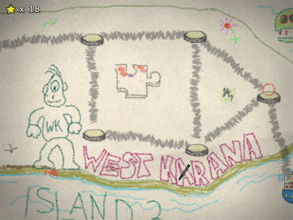
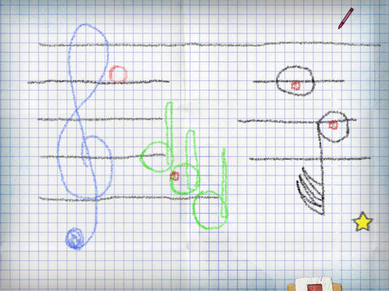
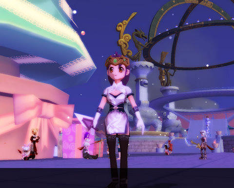

# Crayon Physics Deluxe & DOMO Christmas

*Posted by Tipa on 2008-12-23 07:50:19*

Ripped right from the refrigerator door, [Crayon Physics Deluxe](http://www.crayonphysics.com/) answers the age-old question, "What if those drawings I made in kindergarten were REAL? And I had to guide a ball around them to collide with stars for points?"

The developer has just released the beta/demo, so it's only the first two worlds and a partially functional level editor, but it's cool to think of inventive ways to bring your drawings to life as incredible, crudely-drawn, machines.

Level editor? Sure, I couldn't resist making one of my own.

What music student has never been felt trapped on a staff! Will you trickle down the triplet? Sneak past the hemi-demi-semiquaver? Out-ferment the fermata? (Okay, I forgot to put the fermata in...). One glissando too many, and you could find yourself dropping straight into the bass line... and nobody wants that.

Crayon-based physics puzzle fun. Love it. The full game should be coming out fairly soon... I hope.

After all the meditation I did yesterday, I was only able to get my alchemy in Dream of Mirror Online up one more point, to 9. Just one more to go. I thought that by buying a slightly better kind of incense that I would be conjuring up some blue fragments, but nope, all red. I seriously can't imagine the sort of effort it's going to take to get alchemy from 10 to 15 or 20.

Itziar clued me in to DOMO's Casino Night, where you buy tokens to use in slot machines in the hopes of winning snowballs which you can use to purchase stuff from snowman vendors. I dropped a couple thousand gold into those machines, winning me loads and loads of steaming ... prizes ... and all I could afford from the snowball vendors was some sort of pet saddle which won't work on my pet. So, pretty pointless.

They brought DOMO down last night to add in the holiday decorations. When it came up again, winter was everywhere! I don't know about you, but I'm right in the middle of REAL winter right here. I even got my car stuck in a snowdrift last night. So, mostly in my video games, I want to see warm things. 

Anyway.

Gameiro is working on alchemy too, so he's going to build his forestry up, which will make light armor crafting a lot easier. For some reason, that takes a lot of wood.

I also finally finished downloading and patching that other game, so I played that some while waiting for DOMO to come back up. It's... full of really, really small text.

